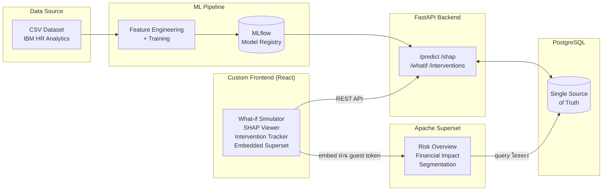
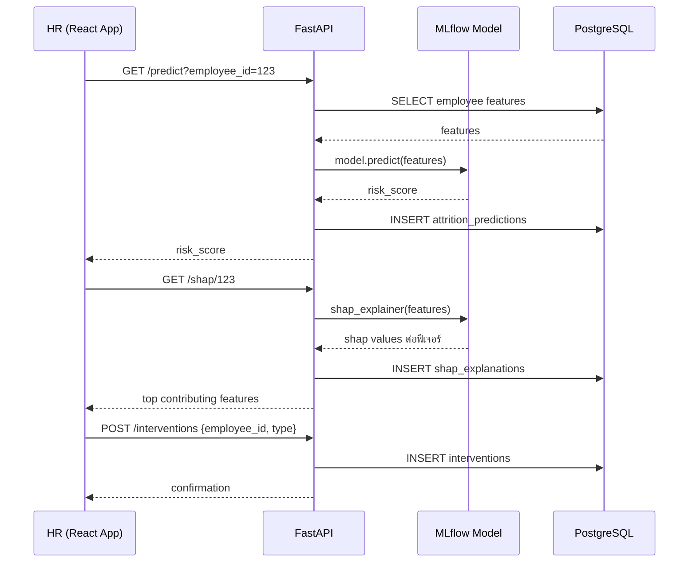

# Employee Attrition Predictor & HR Analytics Platform: Design Blueprint

**เวอร์ชัน:** v0.1 (Pre-development / Design Blueprint)
**อัปเดตล่าสุด:** 23 ก.ย. 2026

> เอกสารนี้เป็น **Living Document** — เขียนขึ้นก่อนเริ่มพัฒนาเพื่อเป็นแนวทางร่วมกันของทีม (API, Data Model, Workflow ที่อธิบายในนี้ยังเป็น "แผน" ไม่ใช่ของที่ implement แล้ว) และจะถูกอัปเดตให้ตรงกับของจริงเมื่อแต่ละ phase พัฒนาเสร็จ

---

## บริบทโปรเจกต์ (Project Context)

- **ประเภทโปรเจกต์:** งานนักศึกษาชั้นปีที่ 4 เทอม 1 สาขาวิทยาการคอมพิวเตอร์ (Proposal Defense) — School of Information Technology (SIT), Sripatum University (SPU)
- **ระยะเวลาพัฒนา:** ทีมทำงานหลัก 9 สัปดาห์ (22 ก.ย. – 23 พ.ย. 2026) + buffer ก่อน Final Exam จริงของรายวิชา (course week 15–16, ~24 พ.ย.–7 ธ.ค. 2026) ดูรายละเอียดที่ [10. Project Timeline](#10-project-timeline-แผนดำเนินงาน)
- **สถานะปัจจุบัน:** wk1 — Foundation & EDA ยังไม่มีโค้ด backend/frontend จริง
- **ขอบเขต:** ระบบต้นแบบ (Prototype) บน IBM HR Analytics Employee Attrition & Performance dataset (Kaggle) ซึ่งเป็น **ข้อมูลจำลอง (synthetic)** ไม่ใช่ข้อมูลองค์กรจริง — ผลลัพธ์และสมมติฐานทางธุรกิจในเอกสารนี้ตั้งอยู่บนข้อจำกัดนี้

---

## Setup Guide (แผนเบื้องต้น)

> ยังไม่มีโค้ดจริงในโปรเจกต์ ขั้นตอนด้านล่างเป็นแผนที่จะใช้เมื่อเริ่มพัฒนา (wk2 เป็นต้นไป) จะปรับปรุงให้ตรงกับของจริงเมื่อแต่ละส่วน implement เสร็จ

### สิ่งที่ต้องติดตั้งก่อน (Prerequisites)

| โปรแกรม | เวอร์ชันขั้นต่ำ | ใช้สำหรับ |
| :--- | :--- | :--- |
| [Python](https://www.python.org/) | 3.11+ | ML/Data pipeline + FastAPI backend |
| [PostgreSQL](https://www.postgresql.org/) | 14+ | Database (Source of truth) |
| [Node.js](https://nodejs.org/) | 18 LTS+ | React frontend |
| [Docker](https://www.docker.com/) + Docker Compose | ล่าสุด | Containerize และรันทุก service พร้อมกัน |

### โครงสร้างโปรเจกต์ที่วางแผนไว้ (Planned Repo Structure)

```
employee-attrition-predictor/
├── data/               # raw & processed dataset (IBM HR CSV)
├── ml/                 # EDA notebooks, feature engineering, training, MLflow
├── backend/            # FastAPI app — /predict /shap /whatif /interventions
├── frontend/           # React app — What-if Simulator, SHAP viewer, Intervention Tracker
├── superset/           # Apache Superset config + dashboard definitions
├── docker-compose.yml
└── README.md
```

> โครงสร้างนี้เป็นแผนเริ่มต้น อาจปรับเมื่อเริ่มเขียนโค้ดจริงตาม phase

### ขั้นตอน Clone (ส่วนที่เหลือจะเพิ่มเมื่อมีโค้ด)

```bash
git clone https://github.com/InkSpuDek66/employee-attrition-predictor.git
cd employee-attrition-predictor
```

> ขั้นตอนสร้าง database, ตั้งค่า `.env`, `docker-compose up`, และรัน migration จะถูกเพิ่มในสัปดาห์ 2–3 (Modeling → Backend phase) เมื่อมีโค้ดให้รันจริง

---

## สารบัญ

1. [System Overview](#1-system-overview-ภาพรวมระบบ)
2. [Team & Working Model](#2-team--working-model-ทีมและรูปแบบการทำงาน)
3. [Core Workflow](#3-core-workflow-predict--explain--act--measure)
4. [Dataset](#4-dataset)
5. [Data Model (High-level)](#5-data-model-high-level-แผนออกแบบข้อมูล)
6. [Business Logic Rules (แผน)](#6-business-logic-rules-แผน)
7. [Planned API Design](#7-planned-api-design-fastapi)
8. [Tech Stack](#8-tech-stack)
9. [System Architecture](#9-system-architecture)
10. [Project Timeline](#10-project-timeline-แผนดำเนินงาน)
11. [Risks & Mitigation](#11-risks--mitigation)
12. [Expected Outcomes](#12-expected-outcomes)

---

## 1. System Overview (ภาพรวมระบบ)

HR ส่วนใหญ่รู้ว่าพนักงานจะลาออก **"หลัง"** จากที่ตัดสินใจไปแล้ว ทำให้ขาดโอกาสดูแลหรือรักษาคนไว้ทัน องค์กรจึงต้องแบกต้นทุนสรรหา/ฝึกอบรมคนใหม่ซ้ำ ๆ (เฉลี่ย 50–200% ของเงินเดือน 1 ปีต่อคน)

โปรเจกต์นี้สร้างระบบที่เลื่อนจุดที่ HR "รู้" ปัญหาให้เร็วขึ้น โดยไม่ได้หยุดแค่การพยากรณ์ (โมเดลในสมุดโน้ต) แต่ต่อยอดเป็นระบบที่ใช้งานได้จริง — พยากรณ์ความเสี่ยงรายบุคคล อธิบายเหตุผลได้ แปลงเป็นตัวเลขต้นทุนให้ตัดสินใจได้ และติดตามผลมาตรการที่ทำไป

### Key Objectives

1. **Risk Prediction** — พยากรณ์ความเสี่ยงลาออกรายบุคคลด้วย Machine Learning (XGBoost)
2. **Explainability (XAI)** — อธิบาย "ทำไม" พนักงานคนนั้นเสี่ยง ด้วย SHAP ไม่ใช่แค่ตัวเลข probability
3. **Financial Impact** — แปลงความเสี่ยงเป็นมูลค่าธุรกิจ เปรียบเทียบ Retain vs Replace เพื่อช่วยจัดลำดับความสำคัญ
4. **Actionable System** — Dashboard + Intervention Tracker ที่ HR ใช้ติดตามและวัดผลมาตรการได้จริง ไม่ใช่แค่รายงานสถิติ
5. **Organization-wide Insight** — สรุปปัจจัยเสี่ยงเด่นทั้งบริษัท/แผนกจาก SHAP รวม ช่วย HR จัดลำดับนโยบายระดับองค์กร ไม่ใช่ดูทีละคนอย่างเดียว

---

## 2. Team & Working Model (ทีมและรูปแบบการทำงาน)

**กลุ่ม 38 - เอเอ๊สกักะดุ๊งกะดิง** | School of Information Technology (SIT), Computer Science — SPU

| รหัสนักศึกษา | ชื่อ |
| :--- | :--- |
| 66080853 | Miss. Yanisa Intharawicha |
| 66076195 | Mr. Saphondanai Chuechan |
| 66079943 | Mr. Puripat Wongtangton |
| 66083478 | Miss. Nanthamon Supo |

**รูปแบบการทำงาน:** ทั้งทีม 4 คนทำงาน phase เดียวกันพร้อมกันตาม [Timeline](#10-project-timeline-แผนดำเนินงาน) แทนการแบ่งสายงานตายตัวรายบุคคล เพื่อให้ทุกคนมีส่วนร่วมและเข้าใจทุกส่วนของระบบ (ไม่มี owner ประจำโมดูลใดโมดูลหนึ่งแบบถาวร)

---

## 3. Core Workflow: Predict → Explain → Act → Measure

ระบบออกแบบเป็นวงจรปิด (closed loop) ไม่ใช่แค่ pipeline ทางเดียว:

```
1. Predict  → FastAPI /predict อ่าน feature ของพนักงานจาก PostgreSQL
              → เรียกโมเดล XGBoost (โหลดจาก MLflow) → คืนค่า risk_score

2. Explain  → FastAPI /shap คำนวณ SHAP values ของพนักงานคนนั้น
              → ส่งค่า contribution รายฟีเจอร์ให้ frontend แสดงผล

3. Act      → HR ดู risk_score + SHAP + financial impact บน React app
              → เลือกมาตรการ (เช่น ปรับเงินเดือน, ลด OT, ให้ stock option)
              → บันทึกเป็น intervention ผ่าน POST /interventions

4. Measure  → ระบบติดตาม outcome ของ intervention ตามช่วงเวลาที่กำหนด
              → ผลใช้ปรับปรุงโมเดลและมาตรการในรอบถัดไป (retrain / re-evaluate)
```

**What-if Simulator** (ส่วนหนึ่งของ Act phase): ผู้ใช้ปรับค่าฟีเจอร์สมมติ (เช่น เพิ่มเงินเดือน, ลด OT) ผ่าน frontend → เรียก `POST /whatif` → ระบบคำนวณ risk_score ใหม่แบบ real-time โดยไม่บันทึกลง database (ใช้ประกอบการตัดสินใจก่อนทำ intervention จริง)

**Company-wide Aggregate Summary** (ส่วนขยายของ Explain phase): นอกจาก SHAP รายบุคคล ระบบรวมค่า SHAP เฉลี่ยของพนักงานทั้งบริษัท/ตามแผนก เพื่อสรุปให้ HR เห็นภาพรวมว่า "ปัจจัยอะไรเป็นตัวขับความเสี่ยงลาออกสูงสุดทั้งองค์กร" พร้อมคำแนะนำเชิงนโยบายแบบ rule-based (เช่น ถ้า OT เป็นปัจจัยอันดับ 1 ทั้งบริษัท → แนะนำทบทวนนโยบาย OT) ผ่าน `GET /company-summary` — ดู [6.6](#66-company-wide-aggregate-summary)

---

## 4. Dataset

**IBM HR Analytics Employee Attrition & Performance** (Kaggle Open Dataset)

| รายการ | ค่า |
| :--- | :--- |
| จำนวนแถว | 1,470 (พนักงาน 1,470 คน) |
| จำนวนคอลัมน์ | 35 ฟีเจอร์ (ตัวเลข + หมวดหมู่) |
| Target column | `Attrition` (Yes/No) |
| อัตราลาออกในชุดข้อมูล | 16.1% (238 คน) — ชุดข้อมูลไม่สมดุล ต้องพิจารณา class imbalance ตอนเทรน |

**ผลจาก EDA เบื้องต้น** (ใช้กำหนดทิศทาง feature engineering ใน Modeling phase):

- ฟีเจอร์ที่สัมพันธ์กับการลาออกชัดสุด: `OverTime` (ลาออก 30.5% เทียบ 10.4% ของคนไม่ทำ OT), `JobRole` (Sales Representative สูงสุด 39.8%)
- กลุ่มฟีเจอร์ที่คาดว่าทำนายได้ดี: `MonthlyIncome`, `Age`, `OverTime`, `TotalWorkingYears`, `YearsAtCompany`, `DistanceFromHome`, `StockOptionLevel`
- ความเสี่ยง Data Leakage: ต้องตรวจสอบ timeline ของแต่ละฟีเจอร์ก่อนใช้เทรน (ดู [11. Risks](#11-risks--mitigation))

### การปรับให้เหมาะกับบริบทไทย (Localization Notes)

ค้นแล้วไม่พบ dataset การลาออกของพนักงานไทยที่เปิดเผยต่อสาธารณะ (ทางเลือกที่พิจารณาแล้วไม่เลือก: dataset สำรวจพนักงานซาอุดีอาระเบียจาก Data in Brief 2025 — ประเทศไม่ตรง, หรือเก็บ survey พนักงานไทยเอง — ใช้เวลามากเกินกรอบ 9 สัปดาห์) จึงยังใช้ IBM dataset เป็นชุดข้อมูลหลักในการเทรน แต่ลดความเสี่ยงเรื่อง cross-cultural transferability ด้วย:

- **คัดฟีเจอร์ที่ไม่น่า transfer ข้ามวัฒนธรรม** — ตัดหรือลดน้ำหนัก `BusinessTravel` (โครงสร้างการเดินทางธุรกิจแบบอเมริกัน) และ `StockOptionLevel` (พบน้อยในบริษัท/SME ไทย) ออกจาก feature set หลัก เก็บไว้เป็น optional feature เท่านั้น
- **เน้นฟีเจอร์สากลที่น่าเชื่อว่ายัง generalize ได้**: `OverTime`, `MonthlyIncome`, `WorkLifeBalance`, `YearsAtCompany`, `DistanceFromHome`, `JobLevel`
- ดู [6.5 Model Localization](#65-model-localization-เพื่อให้ใช้ในไทยได้จริง) สำหรับกลไก recalibrate โมเดลด้วยข้อมูลจริงของบริษัทที่ใช้งาน

---

## 5. Data Model (High-level แผนออกแบบข้อมูล)

> ระดับ High-level เท่านั้น — จะลง column/type ละเอียดตอนเริ่ม Backend phase (wk6–7) เมื่อ schema นิ่งแล้ว

| Entity | หน้าที่ | Key fields (แผน) |
| :--- | :--- | :--- |
| `employees` | Snapshot ข้อมูลพนักงานที่ import จาก dataset | employee_id, demographic/job features, department |
| `model_runs` | อ้างอิง MLflow experiment/version ที่ใช้งานอยู่ | run_id, model_version, metrics, trained_at |
| `attrition_predictions` | ผลพยากรณ์ล่าสุดต่อพนักงานต่อ model run | employee_id, run_id, risk_score, predicted_at |
| `shap_explanations` | ค่า contribution รายฟีเจอร์ของแต่ละ prediction | prediction_id, feature_name, shap_value |
| `financial_impact_estimates` | ประมาณการต้นทุน retain vs replace | employee_id, replacement_cost_estimate, retain_cost_estimate |
| `interventions` | มาตรการที่ HR เลือกทำ + ผลลัพธ์ (Act → Measure) | employee_id, intervention_type, started_at, outcome, measured_at |
| `tenant_calibrations` | ผล recalibration เฉพาะบริษัท (tenant) จากข้อมูลลาออกจริงที่อัปโหลด | tenant_id, calibration_method, sample_size, applied_at |
| `company_risk_summary` | Cache ผลสรุปความเสี่ยงรวมทั้งบริษัท/แผนก (อัปเดตเป็นรอบ) | department, top_risk_factors, avg_risk_score, generated_at |

**ความสัมพันธ์คร่าว ๆ:** `employees 1—* attrition_predictions`, `attrition_predictions 1—* shap_explanations`, `employees 1—* interventions`, `model_runs 1—* attrition_predictions`

---

## 6. Business Logic Rules (แผน)

> กฎเชิงตัวเลข (threshold, cutoff) ทั้งหมดเป็น **ค่าตั้งต้น** จะปรับให้เหมาะสมจริงหลัง Modeling phase (wk2–3) เมื่อเห็นการกระจายของ risk_score จริง

### 6.1 Risk Banding
```
risk_score >= 0.7  → High Risk
0.4 <= risk_score < 0.7 → Medium Risk
risk_score < 0.4   → Low Risk
```

### 6.2 Data Leakage Guard
```
ก่อนใช้ฟีเจอร์ใดเทรนโมเดล:
  -> ตรวจสอบว่าฟีเจอร์นั้นบันทึกค่า ณ เวลาใด
  -> ตัดฟีเจอร์ที่อาจเกิดขึ้น "หลัง" พนักงานตัดสินใจลาออกแล้วออกจาก training set
```

### 6.3 Financial Impact Estimate (อิงกฎหมายแรงงานไทย)
```
severance_pay = ตารางค่าชดเชยตาม พ.ร.บ.คุ้มครองแรงงาน มาตรา 118 (อิงอายุงาน)
  ตัวอย่างโครงสร้าง (ต้องตรวจสอบตัวเลขล่าสุดกับกฎหมายจริงก่อนใช้งานจริง):
    120 วัน – 1 ปี  = ค่าจ้าง 30 วัน
    1 – 3 ปี        = ค่าจ้าง 90 วัน
    3 – 6 ปี        = ค่าจ้าง 180 วัน
    6 – 10 ปี       = ค่าจ้าง 240 วัน
    10 – 20 ปี      = ค่าจ้าง 300 วัน
    20 ปีขึ้นไป      = ค่าจ้าง 400 วัน

replacement_cost_estimate = severance_pay (ถ้าเข้าเงื่อนไข) + recruitment_cost + training_cost
  (recruitment/training cost อ้างอิงเบนช์มาร์กสากล 0.5–2.0 เท่าของเงินเดือนปี ปรับตามตำแหน่ง
   เนื่องจากยังไม่มีเบนช์มาร์กไทยที่เชื่อถือได้)

retain_cost_estimate = ต้นทุนโดยประมาณของมาตรการรักษาคน (เช่น ปรับเงินเดือน, ลด OT)

ROI = replacement_cost_estimate - retain_cost_estimate
```
> ตารางค่าชดเชยเก็บเป็น config แยกจากโค้ดโมเดล เพื่อให้อัปเดตตามกฎหมายที่เปลี่ยนแปลงได้โดยไม่ต้อง retrain

### 6.4 Fairness Check
```
ตรวจสอบ demographic parity / equal opportunity ของ risk_score
  ระหว่างกลุ่มตาม protected attribute (เพศ, ช่วงอายุ) ด้วย Fairlearn
  -> threshold ที่ยอมรับได้จะกำหนดใน Backend & Analysis phase (wk6–7)
```

### 6.5 Model Localization (เพื่อให้ใช้ในไทยได้จริง)
```
Deploy-time (per-tenant):
  ระบบเทรน "โมเดลกลาง" จาก IBM dataset (universal signal เท่านั้น — ดู 4. Dataset)
  เมื่อบริษัทไทยเริ่มใช้งานจริงและมีข้อมูลลาออกในอดีตของตัวเอง:
    -> อัปโหลดผ่าน POST /recalibrate
    -> ปรับ threshold/probability ของโมเดลกลางด้วย Platt scaling หรือ isotonic regression
       โดยใช้ label จริงของบริษัทนั้น (ไม่ retrain โมเดลทั้งก้อนใหม่)
    -> บันทึกผลลง tenant_calibrations แยกต่อบริษัท

ผลลัพธ์: risk_score เชิงอันดับ (ranking) และ SHAP ยังอิง pattern จาก IBM dataset
         แต่ threshold ตัดสิน High/Medium/Low จะปรับเข้ากับพฤติกรรมจริงของบริษัทนั้นได้
```
> ตราบใดที่บริษัทยังไม่ได้ recalibrate ระบบต้องแสดงคำเตือนกำกับ risk_score ว่า "ยังไม่ได้ปรับเทียบกับข้อมูลจริงของบริษัท — ใช้ SHAP (ทิศทางของปัจจัย) ประกอบการตัดสินใจมากกว่าเชื่อตัวเลขตรงๆ" เพื่อความโปร่งใส

### 6.6 Company-wide Aggregate Summary
```
รอบคำนวณ (เช่น รายสัปดาห์ หรือ on-demand ผ่าน GET /company-summary):
  -> ดึง shap_explanations ของพนักงานทั้งหมด (หรือกรองตามแผนก)
  -> คำนวณ mean(|shap_value|) แยกตาม feature_name -> จัดอันดับปัจจัยเสี่ยงเด่นสุด
  -> จับคู่กับ rule-based recommendation table เช่น
       OT สูงสุด            -> "ทบทวนนโยบาย OT / ภาระงาน"
       WorkLifeBalance ต่ำสุด -> "พิจารณาสวัสดิการ/ความยืดหยุ่นเวลาทำงาน"
       MonthlyIncome ต่ำ     -> "ทบทวนโครงสร้างเงินเดือนเทียบตลาด"
  -> รวมกับ financial_impact_estimates เพื่อประเมิน "มูลค่าที่ประหยัดได้โดยประมาณ" ถ้าแก้ปัจจัยนั้น
  -> บันทึกผลลง company_risk_summary (cache ไว้ ไม่คำนวณสดทุกครั้งที่มีคนเปิด dashboard)
```
> **ข้อควรระวัง:** SHAP บอกความสัมพันธ์กับโมเดล ไม่ใช่ความเป็นเหตุเป็นผลที่พิสูจน์แล้ว คำแนะนำทั้งหมดต้องใช้ถ้อยคำเชิงทิศทาง ("น่าจะช่วยลดความเสี่ยง") ไม่ใช่การรับประกันผล — หลักการเดียวกับความโปร่งใสใน [6.5](#65-model-localization-เพื่อให้ใช้ในไทยได้จริง)

---

## 7. Planned API Design (FastAPI)

> รายการนี้เป็นแผนเริ่มต้น จะยืนยัน/ปรับ route จริงตอน Backend phase (wk6–7)

| Method | Endpoint | หน้าที่ |
| :--- | :--- | :--- |
| GET | `/health` | Health check |
| POST | `/predict` | รับ employee features → คืน risk_score |
| GET | `/shap/{employee_id}` | คืน SHAP explanation ของพนักงานคนนั้น |
| POST | `/whatif` | จำลองการเปลี่ยนฟีเจอร์ → คืน risk_score ใหม่ (ไม่บันทึกลง DB) |
| GET | `/financial-impact/{employee_id}` | คืนประมาณการต้นทุน retain vs replace |
| POST | `/interventions` | บันทึกมาตรการที่ HR เลือกทำกับพนักงาน |
| GET | `/interventions/{employee_id}` | ดูประวัติมาตรการของพนักงานคนนั้น |
| GET | `/dashboard/summary` | ข้อมูลสรุปสำหรับ Superset/React dashboard |
| POST | `/recalibrate` | อัปโหลดข้อมูลลาออกจริงของบริษัท (tenant) เพื่อปรับ threshold ให้เข้ากับพฤติกรรมจริง (ดู [6.5](#65-model-localization-เพื่อให้ใช้ในไทยได้จริง)) |
| GET | `/calibration-status/{tenant_id}` | ตรวจสอบว่าบริษัทนี้ recalibrate โมเดลแล้วหรือยัง |
| GET | `/company-summary` | สรุปปัจจัยเสี่ยงเด่นทั้งบริษัท/แผนก พร้อมคำแนะนำเชิงนโยบาย (ดู [6.6](#66-company-wide-aggregate-summary)) |

---

## 8. Tech Stack

| ส่วนประกอบ | เทคโนโลยี | หน้าที่ |
| :--- | :--- | :--- |
| BI / Dashboard | Apache Superset | Dashboard สรุปเชิงบริหาร ต่อ PostgreSQL โดยตรง |
| Frontend | React + Recharts | What-if Simulator, SHAP viewer, Intervention Tracker |
| Backend | FastAPI + Pydantic | Serve model, API endpoints, business logic |
| ML / Data | Scikit-learn, XGBoost, SHAP | Feature engineering, เทรนโมเดล, อธิบายผลลัพธ์ |
| Model Tracking | MLflow | Version model, เปรียบเทียบ experiment |
| Database | PostgreSQL | Source of truth ตัวเดียวทั้งระบบ |
| Deploy | Docker Compose + Render | Containerize และ deploy ทุกส่วน |

---

## 9. System Architecture

สถาปัตยกรรมแบบ Hybrid: Apache Superset (สำหรับ BI เชิงบริหาร) + Custom App (React + FastAPI สำหรับ interactive features)



### Prediction & Explanation Flow (ตัวอย่าง Sequence)



---

## 10. Project Timeline (แผนดำเนินงาน)

### 10.1 Course Milestones (กำหนดการนำเสนอตามรายวิชา)

รายวิชา Machine Learning & Deep Learning for AIoT กำหนด Milestone การนำเสนอไว้ 4 จุดตลอดเทอม — ทีมวางแผนงานภายในให้ deliverable พร้อมก่อนหรือทันแต่ละจุดเหล่านี้:

| Course Week | Milestone | Gate | สิ่งที่ต้องนำเสนอ |
| :--- | :--- | :--- | :--- |
| Week 5 | Proposal Presentation | Proposal Gate | ปัญหาที่ต้องการแก้, ผู้ใช้เป้าหมาย/Impact/SDG, Data source, AI Task และโมเดลเบื้องต้น, แนวคิด Web App — **เสร็จแล้ว** (คือที่มาของสไลด์ตั้งต้นของโปรเจกต์นี้) |
| Week 9 | Data Progress Presentation | Data Gate | Data Collection, EDA, Data Cleaning/Preparation, Split Strategy, ประเด็น Data Leakage หรือข้อจำกัด |
| Week 13 | Model Progress Presentation | Model Gate | Baseline & Candidate Models, Evaluation Metrics, Experiment Results, Error Analysis, เหตุผลการเลือกโมเดล |
| Week 15–16 | Final Project Examination | Product Gate | Final Presentation, Live Demo ของ Web App, Technical Defense, สรุป Impact/Innovation/SDG, ส่งไฟล์และเอกสารประกอบ |

**สิ่งที่ต้องเตรียมทุกครั้งที่นำเสนอ:** สไลด์นำเสนอ, Demo หรือผลการทดสอบ, หลักฐานข้อมูล/โค้ด/กราฟ/ตารางผลลัพธ์, ไฟล์งานใน GitHub Repository, การแบ่งบทบาทสมาชิกในทีม

**หมายเหตุจากรายวิชา:** สัปดาห์ที่มีการนำเสนอไม่มีการสอนเนื้อหาใหม่ / ทุกทีมควรอัปเดตความก้าวหน้าอย่างต่อเนื่อง / ผลงานต้องทำงานได้จริงในรูปแบบ AI-powered Web App / เน้น Innovation, Impact และความเป็นไปได้ในการนำไปใช้จริง

### 10.2 แผนงานทีม (Team Sprint) เทียบกับ Course Week

> **สมมติฐานวันที่:** คำนวณจากที่ทีมยืนยันว่า Week 9 (Data Gate) ตรงกับสัปดาห์ที่ 4 ของแผนทีม (wk4–5) → **Course Week = Team Week + 5** — ถ้าวันที่จริงของปฏิทินรายวิชาไม่ตรงกับที่คำนวณไว้ ช่วยแจ้งเพื่อปรับตารางด้านล่าง

Scope เต็มตามที่เสนอ (รวม Survival Analysis, Fairness, Superset embedding) บีบจากแผนเดิม 12 สัปดาห์เหลือ 9 สัปดาห์ทำงานหลัก โดยคง core phase (Modeling, SHAP+Progress Check, Backend&Analysis, BI&Frontend) ไว้เท่าเดิม และเผื่อ buffer ก่อนสอบจริง

| Team Week | ช่วงวันที่ (2026) | Phase | Course Week | Deliverable checkpoint |
| :--- | :--- | :--- | :--- | :--- |
| wk1 | 22–28 ก.ย. | Foundation & EDA | Week 6 | — |
| wk2–3 | 29 ก.ย.–12 ต.ค. | Modeling | Week 7–8 | โมเดลเทรนเสร็จ (baseline + candidate) พร้อม MLflow tracking |
| wk4–5 | 13–26 ต.ค. | SHAP + Progress Check | **Week 9–10 — Data Gate ★** | ต้องมีโมเดลที่เทรนเสร็จแล้ว (จาก wk2–3) + SHAP เบื้องต้น พร้อม slide นำเสนอ Data Gate |
| wk6–7 | 27 ต.ค.–9 พ.ย. | Backend & Analysis | Week 11–12 | — |
| wk8–9 | 10–23 พ.ย. | BI & Frontend + Closing & Delivery | **Week 13–14 — Model Gate ★** | นำเสนอผล Model/Experiment ที่ Model Gate + ปิดงาน Dashboard/Frontend |
| buffer | 24 พ.ย.–7 ธ.ค. | Final polish + สอบจริง | **Week 15–16 — Product Gate ★** | Final Presentation, Live Demo, Technical Defense |

★ = Course Milestone Gate ตาม [10.1](#101-course-milestones-กำหนดการนำเสนอตามรายวิชา)

### 10.3 การแบ่งงานรายบุคคลในแต่ละ Phase (ละเอียด)

**หลักการ:** งานยิ่งยาก ยิ่งใช้คนเยอะ และ **งาน 🔴 ยาก ทุกจุดเน้นให้ Puripat + Saphondanai เป็นตัวหลัก** (คู่นี้รับงานเทคนิคหนักสุดของแต่ละ phase ต่อเนื่องกันตลอดโปรเจกต์ — เป็นเจ้าของ pipeline ข้อมูล→โมเดลแบบไม่ขาดสาย: Data Cleaning → Feature Engineering → Train/tune Model → FastAPI endpoints หลัก → React ส่วนซับซ้อน — เพื่อให้ context ของงานต่อเนื่องกัน ไม่ต้องส่งต่อข้อมูลข้ามคน) ส่วน Yanisa + Nanthamon รับงาน 🟡/🟢 ที่เหลือเป็นหลัก (EDA → baseline model → endpoint รอง → Survival/Fairness → React ส่วนที่เบากว่า) แต่ยังช่วยกันข้ามกลุ่มได้เสมอเมื่อใครติดขัดหรือมีเวลาว่าง งานที่ง่ายแต่กินเวลาให้กระจายทำเป็นชิ้นเล็กๆ ทั้งทีมแทนที่จะดึงคนไปทำเต็มเวลาคนเดียว ส่วนงานที่ตามธรรมชาติต้อง "รวมเป็นหนึ่งเดียว" (โมเดล, database, schema) จะแก้ด้วยเครื่องมือที่ออกแบบมาให้ทำงานคนละเครื่องแล้ว sync กันได้ ไม่ใช่การนั่งเครื่องเดียวกันจริงๆ (สรุปวิธีไว้ท้ายหัวข้อ)

> **หมายเหตุภาระงาน:** ด้วยโครงสร้างนี้ Puripat + Saphondanai จะแบกงานเทคนิคหนักต่อเนื่องเกือบตลอดทั้งโปรเจกต์ เป็นการตัดสินใจที่ยืนยันแล้วว่าต้องการให้เป็นแบบนี้ (เน้นความต่อเนื่องของ context มากกว่าการถ่วงดุลภาระงาน)

ระดับความยาก: 🔴 ยาก (3–4 คน) / 🟡 ปานกลาง (2 คน) / 🟢 ง่ายแต่ใช้เวลานาน (กระจายทำทั้งทีม)

**wk1 — Foundation & EDA**

| งาน | ระดับ | คนที่ทำ | วิธีทำโดยละเอียด |
| :--- | :--- | :--- | :--- |
| Requirement + ตั้งสมมติฐานธุรกิจ | 🟢 | ทั้ง 4 คน (1 meeting ~2–3 ชม.) | ประชุมสรุปขอบเขตจากสไลด์ proposal เดิม เขียนลง doc ร่วม (Google Docs) ไม่ต้องรอ merge code |
| Data cleaning (missing value, encode, ตรวจ data leakage ตาม [6.2](#62-data-leakage-guard)) | 🟡 | Saphondanai + Puripat | ทำใน notebook คนละไฟล์ (`01_cleaning_S.ipynb`, `01_cleaning_P.ipynb`) เทียบกันแล้วรวมเป็น `clean_pipeline.py` ไฟล์เดียวตอนจบสัปดาห์ |
| EDA (สถิติ/กราฟเปรียบเทียบกลุ่มลาออก/ไม่ลาออก) | 🟢 (กราฟเยอะ ใช้เวลานาน) | Yanisa + Nanthamon แบ่งครึ่งฟีเจอร์ (ตัวเลข vs หมวดหมู่) | แบ่งตามกลุ่มฟีเจอร์ ทำคนละ notebook ไม่ชนกัน |

> **ของที่ต้อง "รวมเป็นหนึ่ง":** ไฟล์ dataset ดิบ (CSV) — โหลดจาก Kaggle ครั้งเดียว push เข้า `data/raw/` ใน git แล้วทุกคน pull ไปใช้ในเครื่องตัวเอง ไม่มีใครแก้ไฟล์ raw โดยตรง (read-only) ผลลัพธ์การ clean ไปรวมที่ `data/processed/` แทน

**wk2–3 — Modeling**

| งาน | ระดับ | คนที่ทำ | วิธีทำโดยละเอียด |
| :--- | :--- | :--- | :--- |
| Feature engineering | 🟡 | Puripat + Saphondanai (ต่อเนื่องจากคนที่ทำ Data Cleaning ใน wk1) | ทำงานบน `data/processed/` ที่ตัวเองเป็นคนทำ cleaning มาต่อเนื่อง เข้าใจ context ของแต่ละคอลัมน์อยู่แล้ว ไม่ต้องมาอธิบายกันใหม่ commit เป็น `feature_pipeline.py` แยกจาก training script |
| Train + tune model หลัก (XGBoost + hyperparameter search) | 🔴 ยากสุดใน phase — **เน้น Puripat + Saphondanai เป็นหลัก** | Puripat + Saphondanai (lead) | รับผิดชอบโมเดลหลักที่มีแนวโน้มถูก promote ไปใช้จริง ลอง config หลายชุดบนเครื่องตัวเอง log เข้า MLflow เป็นคนตัดสินใจเลือก run สุดท้ายร่วมกัน |
| Train model เปรียบเทียบ (baseline: Logistic Regression, Random Forest) | 🟡 | Yanisa + Nanthamon | ลองโมเดลง่ายกว่าเพื่อเป็น baseline เทียบผล log เข้า MLflow เดียวกัน ช่วยยืนยันว่าโมเดลหลักที่ Puripat/Saphondanai เลือกดีกว่าจริง |
| ตั้งค่า MLflow tracking server (ครั้งแรก, บล็อกงานอื่น) | 🟢 (งาน setup ครั้งเดียว) | Saphondanai คนเดียว | ทำก่อนคนอื่นเริ่ม train แจก connection URI ให้ทีมผ่าน `.env.example` |

**wk4–5 — SHAP + Progress Check + Company-wide Summary**

| งาน | ระดับ | คนที่ทำ | วิธีทำโดยละเอียด |
| :--- | :--- | :--- | :--- |
| SHAP integration รายบุคคล | 🟡 | Yanisa + Puripat | โหลด model version ที่ promote แล้วจาก MLflow registry มาคำนวณ SHAP (read-only ต่อโมเดล ไม่ชนกัน) |
| Company-wide Aggregate Summary ([6.6](#66-company-wide-aggregate-summary)) | 🟡 | Saphondanai + Nanthamon | รวมค่า SHAP เฉลี่ยตามแผนก/บริษัท + เขียน rule-based recommendation — **รอ SHAP รายบุคคลเสร็จก่อน** (dependency ไม่ parallel 100% แม้คนละคู่ ให้เริ่มงาน SHAP รายบุคคลก่อน 2–3 วัน) |
| เตรียม slide + นำเสนอ Data Gate | 🟢 | ทั้ง 4 คนคนละ 2–3 แผ่น แล้วซ้อมพูดพร้อมกัน 1 รอบ | ใช้ Google Slides ร่วม แก้พร้อมกันได้ ไม่ชนกันเหมือนไฟล์ local |

**wk6–7 — Backend & Analysis**

| งาน | ระดับ | คนที่ทำ | วิธีทำโดยละเอียด |
| :--- | :--- | :--- | :--- |
| FastAPI endpoints หลัก ที่ต่อกับโมเดลโดยตรง (`/predict /shap /whatif /recalibrate /company-summary`) | 🔴 ยาก — **เน้น Puripat + Saphondanai** | Puripat + Saphondanai (lead) | ยากสุดเพราะต้องต่อกับ MLflow model + SHAP explainer จริง แยกไฟล์ router คนละไฟล์ (`routers/predict.py`, `routers/recalibrate.py` ฯลฯ) ใช้ FastAPI `APIRouter` แล้ว include เข้า `main.py` ทีหลัง ต่อ **dev database กลางบน cloud ฟรี** (เช่น Supabase/Neon) แทนที่จะรัน Postgres แยกเครื่องใครเครื่องมัน |
| FastAPI endpoints รอง (`/interventions /calibration-status /dashboard/summary /health`) | 🟡 | Yanisa + Nanthamon | เป็น CRUD/query ธรรมดา ไม่ต้องต่อโมเดลโดยตรง ทำคนละไฟล์ router เชื่อม dev database เดียวกับด้านบน |
| Survival Analysis | 🔴 ยาก (เทคนิคใหม่ที่ทีมยังไม่เคยทำ) | Yanisa + Nanthamon (เริ่มก่อนตั้งแต่ต้นสัปดาห์เพราะเบากว่างาน endpoint หลัก, ขอความช่วยเหลือจาก Puripat/Saphondanai ได้เมื่อทำ endpoint หลักเสร็จ) | เริ่มจาก tutorial ของ `lifelines` library ก่อน แล้วค่อย apply กับ dataset จริง |
| Fairness check (Fairlearn) | 🟡 | Yanisa + Nanthamon | ทำต่อจาก Survival Analysis ได้เลย เพราะอ่านผลจากโมเดลเดียวกัน ไม่ต้องแก้โมเดล — ถ้าเวลาไม่พอให้ Puripat/Saphondanai ช่วย review หลังทำ endpoint หลักเสร็จ |

**wk8–9 — BI & Frontend + Closing**

| งาน | ระดับ | คนที่ทำ | วิธีทำโดยละเอียด |
| :--- | :--- | :--- | :--- |
| React frontend — What-if Simulator + SHAP viewer (ส่วนที่ซับซ้อนสุด) | 🔴 ยากสุด — **เน้น Puripat + Saphondanai** | Puripat + Saphondanai (lead) | What-if ต้องเรียก `/whatif` แบบ real-time + จัดการ state ของค่าที่ผู้ใช้ปรับ, SHAP viewer ต้อง render ข้อมูลซ้อน (nested) เป็นกราฟ — ยากสุดในฝั่ง frontend |
| React frontend — Intervention Tracker + Company Summary panel | 🟡 | Yanisa + Nanthamon | ส่วนใหญ่เป็น list/form CRUD ธรรมดา และแสดงผลข้อมูลสรุปแบบ static เชื่อม backend ผ่าน API contract เดียวกัน (หัวข้อ 7) — endpoint ไหนยังไม่เสร็จให้ mock response ตาม schema ไปก่อน ไม่ต้องรอ |
| Superset dashboard + Financial Impact + Company Summary panel | 🟡 | Nanthamon (นำ) — Puripat ช่วย review หลังทำ React ส่วนหลักเสร็จ | ต่อ Superset เข้า dev database เดียวกับ backend โดยตรง ส่วนใหญ่เป็นการตั้งค่า/ลากชาร์ตผ่าน UI ไม่ใช่โค้ดหนักเหมือน React จึงให้ Nanthamon ทำนำคนเดียวได้ก่อน ทำคู่ขนานกับ React ได้เพราะคนละ service — *แก้จากเดิมที่ให้ Puripat ทำคู่ เพราะ Puripat ติดงาน React ส่วนหลักพร้อมกันในสัปดาห์เดียวกันอยู่แล้ว* |
| Integration testing (รวมทุก service มาทดสอบพร้อมกันจริง) | 🟡 แต่ **ต้องทำพร้อมกันทั้งทีมในเวลาเดียวกัน** | ทั้ง 4 คน | งานนี้แยกกันทำไม่ได้จริงๆ เพราะต้องเห็นทุก service ทำงานร่วมกัน — นัดเวลา call พร้อมกัน รัน `docker-compose up` พร้อมกันแล้ว screen-share ตรวจดูร่วมกัน (ไม่ต้องอยู่เครื่องเดียวกัน แค่เวลาต้องตรงกัน) |
| รายงานจบ + slide นำเสนอ Model Gate / Final | 🟢 | ทั้ง 4 คนคนละหัวข้อ | แบ่งหัวข้อรายงานคนละส่วนเขียนใน Google Docs พร้อมกัน |

### วิธีแก้ปัญหา "งานที่ต้องทำในเครื่องเดียว" (สรุปรวม)

| ปัญหา | ทางแก้ |
| :--- | :--- |
| โค้ดฐานเดียวกัน หลายคนแก้พร้อมกัน | Git: แต่ละคนทำงานใน feature branch ของตัวเอง → เปิด Pull Request → review → merge เข้า `main`/`dev` ไม่มีใครแก้ไฟล์เดียวกันพร้อมกันโดยไม่รู้ตัว |
| Train โมเดลต้องมี "ตัวจริง" ตัวเดียว | MLflow tracking server กลาง — ทุกคน train บนเครื่องตัวเอง, log ผลเข้าจุดเดียวกัน, เทียบและเลือก run ที่ดีที่สุดมา promote ร่วมกัน |
| Database ต้องเป็น Source of Truth เดียว | Dev database กลางบน cloud (Supabase/Neon free tier) แทน local Postgres แยกเครื่อง ทุกคน connect เข้าตัวเดียวกัน |
| Backend เสร็จช้ากว่า Frontend | Contract-first: ตกลง request/response schema ล่วงหน้า (หัวข้อ 7) frontend mock ข้อมูลไปก่อนได้ ไม่ต้องรอ |
| งานที่ต้องเห็นภาพรวมพร้อมกันจริงๆ (integration test, ซ้อมนำเสนอ) | นัดเวลาทำพร้อมกัน (video call/ห้องเดียวกัน) ไม่พยายามแยกงานประเภทนี้ออกจากกัน |

### งานง่ายแต่ใช้เวลานาน — วิธีจัดการ

งานประเภทนี้ (EDA visualization, เตรียม slide, เขียนรายงาน, ค้นข้อมูลกฎหมายแรงงานไทยสำหรับ [6.3](#63-financial-impact-estimate-อิงกฎหมายแรงงานไทย)) ไม่ต้องการคนเก่งเฉพาะทาง แต่กินเวลาเยอะถ้าให้คนเดียวทำ:

- แบ่งเป็นชิ้นเล็กที่สุดเท่าที่ทำได้ (เช่น กราฟคนละ 3–4 แบบ แทนที่จะให้ 1 คนทำ 15 แบบ) กระจายให้ทุกคนทำคู่ขนานแบบไม่ต้องรอกัน
- ใช้เวลาว่างระหว่างรอ dependency (เช่น ระหว่างรอโมเดลเทรนเสร็จ ก็เตรียม slide ไปพร้อมกันได้)
- ไม่ดึงคนที่กำลังทำงาน 🔴 ยาก ไปช่วยงานประเภทนี้ เพราะจะเสีย focus จากงานที่ต้องใช้ความเข้าใจลึก

---

## 11. Risks & Mitigation

| ความเสี่ยง | รายละเอียด | แผนรับมือ |
| :--- | :--- | :--- |
| Data Leakage | ฟีเจอร์บางตัวอาจเกิดขึ้นหลังพนักงานตัดสินใจลาออกไปแล้ว | ตรวจสอบ timeline ของแต่ละฟีเจอร์ก่อนใช้เทรน (ดู [6.2](#62-data-leakage-guard)) |
| Synthetic Data | ข้อมูลจาก IBM เป็นข้อมูลจำลอง ไม่ใช่ข้อมูลจริงขององค์กร | ตั้งสมมติฐานธุรกิจอย่างระมัดระวัง ระบุข้อจำกัดชัดเจนตอนนำเสนอ |
| Cross-cultural Generalization | โมเดลเทรนจากพฤติกรรมพนักงานอเมริกัน (IBM) อาจไม่ตรงกับพนักงานไทย ไม่มี dataset ไทยสำเร็จรูปให้ใช้แทน | คัดฟีเจอร์ที่ไม่ transfer ออก (ดู [4. Dataset](#4-dataset)) + เปิดให้ recalibrate ด้วยข้อมูลจริงของบริษัท (ดู [6.5](#65-model-localization-เพื่อให้ใช้ในไทยได้จริง)) + สื่อสารข้อจำกัดนี้ชัดเจนตอนนำเสนอ |
| เวลาพัฒนาจำกัด (9 สัปดาห์) | Scope เต็มมีหลายฟีเจอร์ขั้นสูง (Survival, Fairness, Superset) ในเวลาที่บีบลงจาก 12 สัปดาห์ | จัดลำดับความสำคัญ core feature ก่อน ฟีเจอร์เสริมเป็น stretch goal หากเวลาไม่พอ |
| Superset Embedding | การเชื่อม Auth ระหว่าง Superset กับ frontend อาจซับซ้อน | สำรองแผนใช้ iframe แบบพื้นฐานหากติดปัญหาเรื่องเวลา |

---

## 12. Expected Outcomes

ระบบต้นแบบที่ HR นำไปใช้ลดการลาออกได้จริง ไม่ใช่แค่โมเดลในสมุดโน้ต:

- โมเดลพยากรณ์ความเสี่ยงลาออกพร้อม Explainability (SHAP)
- Dashboard เชิงบริหาร (Superset) + Interactive App สำหรับ HR
- Financial Impact Estimate ที่อิงกฎหมายแรงงานไทย แปลงผลเป็นการตัดสินใจเชิงธุรกิจได้จริง
- กลไก Recalibration ที่ปรับโมเดลกลางให้เข้ากับพฤติกรรมพนักงานของแต่ละบริษัทไทยที่ใช้งานจริง (ดู [6.5](#65-model-localization-เพื่อให้ใช้ในไทยได้จริง))
- Company-wide Aggregate Summary ที่แปล SHAP รายบุคคลจำนวนมากให้เป็นคำแนะนำเชิงนโยบายระดับองค์กร ให้ HR ดูภาพรวมได้ในหน้าเดียว (ดู [6.6](#66-company-wide-aggregate-summary))
