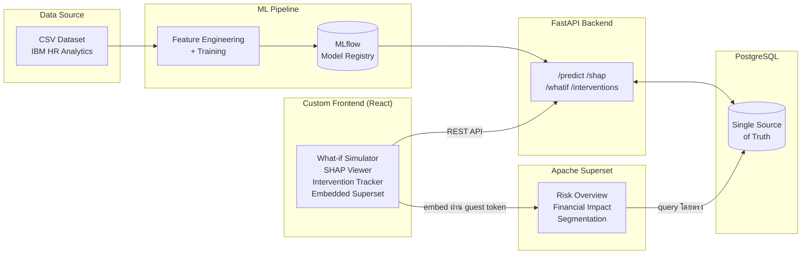
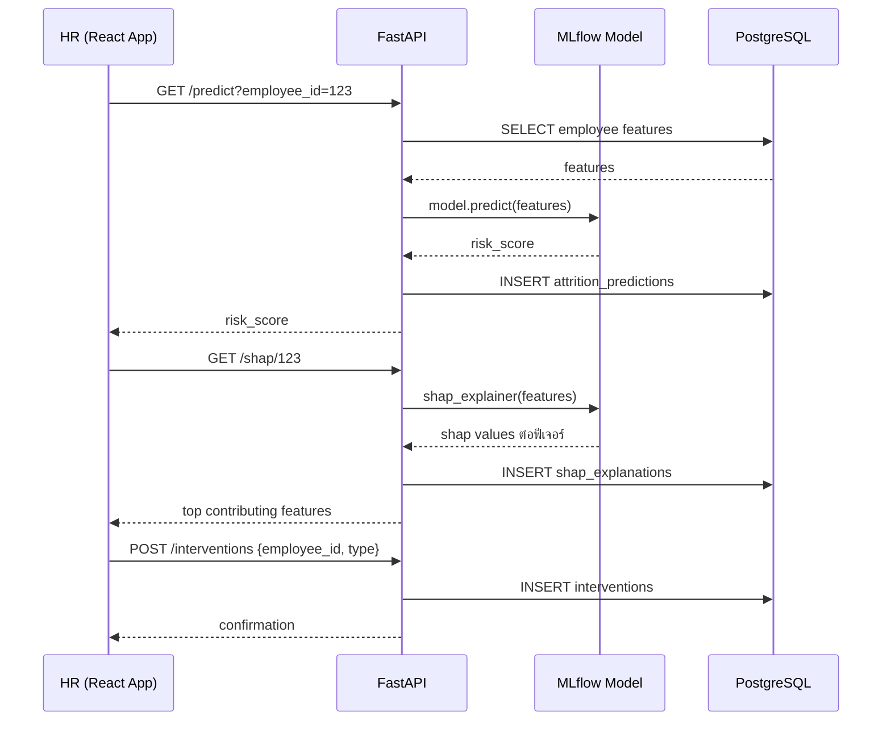

# Employee Attrition Predictor & HR Analytics Platform: Design Blueprint

**เวอร์ชัน:** v0.1 (Pre-development / Design Blueprint)
**อัปเดตล่าสุด:** 19 ก.ย. 2026

> เอกสารนี้เป็น **Living Document** — เขียนขึ้นก่อนเริ่มพัฒนาเพื่อเป็นแนวทางร่วมกันของทีม (API, Data Model, Workflow ที่อธิบายในนี้ยังเป็น "แผน" ไม่ใช่ของที่ implement แล้ว) และจะถูกอัปเดตให้ตรงกับของจริงเมื่อแต่ละ phase พัฒนาเสร็จ

---

## บริบทโปรเจกต์ (Project Context)

- **ประเภทโปรเจกต์:** งานนักศึกษาชั้นปีที่ 4 เทอม 1 สาขาวิทยาการคอมพิวเตอร์ (Proposal Defense) — School of Information Technology (SIT), Sripatum University (SPU)
- **ระยะเวลาพัฒนา:** 9 สัปดาห์ (22 ก.ย. – 23 พ.ย. 2026) ดูรายละเอียดที่ [8. Project Timeline](#8-project-timeline-แผนดำเนินงาน)
- **สถานะปัจจุบัน:** wk1 — Foundation & EDA ยังไม่มีโค้ด backend/frontend จริง
- **ขอบเขต:** ระบบต้นแบบ (Prototype) บน IBM HR Analytics Employee Attrition & Performance dataset (Kaggle) ซึ่งเป็น **ข้อมูลจำลอง (synthetic)** ไม่ใช่ข้อมูลองค์กรจริง — ผลลัพธ์และสมมติฐานทางธุรกิจในเอกสารนี้ตั้งอยู่บนข้อจำกัดนี้

---

## Setup Guide (แผนเบื้องต้น)

> ยังไม่มีโค้ดจริงในโปรเจกต์ ขั้นตอนด้านล่างเป็นแผนที่จะใช้เมื่อเริ่มพัฒนา (wk2 เป็นต้นไป) จะปรับปรุงให้ตรงกับของจริงเมื่อแต่ละส่วน implement เสร็จ

### สิ่งที่ต้องติดตั้งก่อน (Prerequisites)

| โปรแกรม | เวอร์ชันขั้นต่ำ | ใช้สำหรับ |
| :--- | :--- | :--- |
| [Python](https://www.python.org/) | 3.11+ | ML/Data pipeline + FastAPI backend |
| [PostgreSQL](https://www.postgresql.org/) | 14+ | Database (Source of truth) |
| [Node.js](https://nodejs.org/) | 18 LTS+ | React frontend |
| [Docker](https://www.docker.com/) + Docker Compose | ล่าสุด | Containerize และรันทุก service พร้อมกัน |

### โครงสร้างโปรเจกต์ที่วางแผนไว้ (Planned Repo Structure)

```
employee-attrition-predictor/
├── data/               # raw & processed dataset (IBM HR CSV)
├── ml/                 # EDA notebooks, feature engineering, training, MLflow
├── backend/            # FastAPI app — /predict /shap /whatif /interventions
├── frontend/           # React app — What-if Simulator, SHAP viewer, Intervention Tracker
├── superset/           # Apache Superset config + dashboard definitions
├── docker-compose.yml
└── README.md
```

> โครงสร้างนี้เป็นแผนเริ่มต้น อาจปรับเมื่อเริ่มเขียนโค้ดจริงตาม phase

### ขั้นตอน Clone (ส่วนที่เหลือจะเพิ่มเมื่อมีโค้ด)

```bash
git clone https://github.com/InkSpuDek66/employee-attrition-predictor.git
cd employee-attrition-predictor
```

> ขั้นตอนสร้าง database, ตั้งค่า `.env`, `docker-compose up`, และรัน migration จะถูกเพิ่มในสัปดาห์ 2–3 (Modeling → Backend phase) เมื่อมีโค้ดให้รันจริง

---

## สารบัญ

1. [System Overview](#1-system-overview-ภาพรวมระบบ)
2. [Team & Working Model](#2-team--working-model-ทีมและรูปแบบการทำงาน)
3. [Core Workflow](#3-core-workflow-predict--explain--act--measure)
4. [Dataset](#4-dataset)
5. [Data Model (High-level)](#5-data-model-high-level-แผนออกแบบข้อมูล)
6. [Business Logic Rules (แผน)](#6-business-logic-rules-แผน)
7. [Planned API Design](#7-planned-api-design-fastapi)
8. [Tech Stack](#8-tech-stack)
9. [System Architecture](#9-system-architecture)
10. [Project Timeline](#10-project-timeline-แผนดำเนินงาน)
11. [Risks & Mitigation](#11-risks--mitigation)
12. [Expected Outcomes](#12-expected-outcomes)

---

## 1. System Overview (ภาพรวมระบบ)

HR ส่วนใหญ่รู้ว่าพนักงานจะลาออก **"หลัง"** จากที่ตัดสินใจไปแล้ว ทำให้ขาดโอกาสดูแลหรือรักษาคนไว้ทัน องค์กรจึงต้องแบกต้นทุนสรรหา/ฝึกอบรมคนใหม่ซ้ำ ๆ (เฉลี่ย 50–200% ของเงินเดือน 1 ปีต่อคน)

โปรเจกต์นี้สร้างระบบที่เลื่อนจุดที่ HR "รู้" ปัญหาให้เร็วขึ้น โดยไม่ได้หยุดแค่การพยากรณ์ (โมเดลในสมุดโน้ต) แต่ต่อยอดเป็นระบบที่ใช้งานได้จริง — พยากรณ์ความเสี่ยงรายบุคคล อธิบายเหตุผลได้ แปลงเป็นตัวเลขต้นทุนให้ตัดสินใจได้ และติดตามผลมาตรการที่ทำไป

### Key Objectives

1. **Risk Prediction** — พยากรณ์ความเสี่ยงลาออกรายบุคคลด้วย Machine Learning (XGBoost)
2. **Explainability (XAI)** — อธิบาย "ทำไม" พนักงานคนนั้นเสี่ยง ด้วย SHAP ไม่ใช่แค่ตัวเลข probability
3. **Financial Impact** — แปลงความเสี่ยงเป็นมูลค่าธุรกิจ เปรียบเทียบ Retain vs Replace เพื่อช่วยจัดลำดับความสำคัญ
4. **Actionable System** — Dashboard + Intervention Tracker ที่ HR ใช้ติดตามและวัดผลมาตรการได้จริง ไม่ใช่แค่รายงานสถิติ

---

## 2. Team & Working Model (ทีมและรูปแบบการทำงาน)

**กลุ่ม 38 - เอเอ๊สกักะดุ๊งกะดิง** | School of Information Technology (SIT), Computer Science — SPU

| รหัสนักศึกษา | ชื่อ |
| :--- | :--- |
| 66080853 | Miss. Yanisa Intharawicha |
| 66076195 | Mr. Saphondanai Chuechan |
| 66079943 | Mr. Puripat Wongtangton |
| 66083478 | Miss. Nanthamon Supo |

**รูปแบบการทำงาน:** ทั้งทีม 4 คนทำงาน phase เดียวกันพร้อมกันตาม [Timeline](#10-project-timeline-แผนดำเนินงาน) แทนการแบ่งสายงานตายตัวรายบุคคล เพื่อให้ทุกคนมีส่วนร่วมและเข้าใจทุกส่วนของระบบ (ไม่มี owner ประจำโมดูลใดโมดูลหนึ่งแบบถาวร)

---

## 3. Core Workflow: Predict → Explain → Act → Measure

ระบบออกแบบเป็นวงจรปิด (closed loop) ไม่ใช่แค่ pipeline ทางเดียว:

```
1. Predict  → FastAPI /predict อ่าน feature ของพนักงานจาก PostgreSQL
              → เรียกโมเดล XGBoost (โหลดจาก MLflow) → คืนค่า risk_score

2. Explain  → FastAPI /shap คำนวณ SHAP values ของพนักงานคนนั้น
              → ส่งค่า contribution รายฟีเจอร์ให้ frontend แสดงผล

3. Act      → HR ดู risk_score + SHAP + financial impact บน React app
              → เลือกมาตรการ (เช่น ปรับเงินเดือน, ลด OT, ให้ stock option)
              → บันทึกเป็น intervention ผ่าน POST /interventions

4. Measure  → ระบบติดตาม outcome ของ intervention ตามช่วงเวลาที่กำหนด
              → ผลใช้ปรับปรุงโมเดลและมาตรการในรอบถัดไป (retrain / re-evaluate)
```

**What-if Simulator** (ส่วนหนึ่งของ Act phase): ผู้ใช้ปรับค่าฟีเจอร์สมมติ (เช่น เพิ่มเงินเดือน, ลด OT) ผ่าน frontend → เรียก `POST /whatif` → ระบบคำนวณ risk_score ใหม่แบบ real-time โดยไม่บันทึกลง database (ใช้ประกอบการตัดสินใจก่อนทำ intervention จริง)

---

## 4. Dataset

**IBM HR Analytics Employee Attrition & Performance** (Kaggle Open Dataset)

| รายการ | ค่า |
| :--- | :--- |
| จำนวนแถว | 1,470 (พนักงาน 1,470 คน) |
| จำนวนคอลัมน์ | 35 ฟีเจอร์ (ตัวเลข + หมวดหมู่) |
| Target column | `Attrition` (Yes/No) |
| อัตราลาออกในชุดข้อมูล | 16.1% (238 คน) — ชุดข้อมูลไม่สมดุล ต้องพิจารณา class imbalance ตอนเทรน |

**ผลจาก EDA เบื้องต้น** (ใช้กำหนดทิศทาง feature engineering ใน Modeling phase):

- ฟีเจอร์ที่สัมพันธ์กับการลาออกชัดสุด: `OverTime` (ลาออก 30.5% เทียบ 10.4% ของคนไม่ทำ OT), `JobRole` (Sales Representative สูงสุด 39.8%)
- กลุ่มฟีเจอร์ที่คาดว่าทำนายได้ดี: `MonthlyIncome`, `Age`, `OverTime`, `TotalWorkingYears`, `YearsAtCompany`, `DistanceFromHome`, `StockOptionLevel`
- ความเสี่ยง Data Leakage: ต้องตรวจสอบ timeline ของแต่ละฟีเจอร์ก่อนใช้เทรน (ดู [11. Risks](#11-risks--mitigation))

---

## 5. Data Model (High-level แผนออกแบบข้อมูล)

> ระดับ High-level เท่านั้น — จะลง column/type ละเอียดตอนเริ่ม Backend phase (wk6–7) เมื่อ schema นิ่งแล้ว

| Entity | หน้าที่ | Key fields (แผน) |
| :--- | :--- | :--- |
| `employees` | Snapshot ข้อมูลพนักงานที่ import จาก dataset | employee_id, demographic/job features, department |
| `model_runs` | อ้างอิง MLflow experiment/version ที่ใช้งานอยู่ | run_id, model_version, metrics, trained_at |
| `attrition_predictions` | ผลพยากรณ์ล่าสุดต่อพนักงานต่อ model run | employee_id, run_id, risk_score, predicted_at |
| `shap_explanations` | ค่า contribution รายฟีเจอร์ของแต่ละ prediction | prediction_id, feature_name, shap_value |
| `financial_impact_estimates` | ประมาณการต้นทุน retain vs replace | employee_id, replacement_cost_estimate, retain_cost_estimate |
| `interventions` | มาตรการที่ HR เลือกทำ + ผลลัพธ์ (Act → Measure) | employee_id, intervention_type, started_at, outcome, measured_at |

**ความสัมพันธ์คร่าว ๆ:** `employees 1—* attrition_predictions`, `attrition_predictions 1—* shap_explanations`, `employees 1—* interventions`, `model_runs 1—* attrition_predictions`

---

## 6. Business Logic Rules (แผน)

> กฎเชิงตัวเลข (threshold, cutoff) ทั้งหมดเป็น **ค่าตั้งต้น** จะปรับให้เหมาะสมจริงหลัง Modeling phase (wk2–3) เมื่อเห็นการกระจายของ risk_score จริง

### 6.1 Risk Banding
```
risk_score >= 0.7  → High Risk
0.4 <= risk_score < 0.7 → Medium Risk
risk_score < 0.4   → Low Risk
```

### 6.2 Data Leakage Guard
```
ก่อนใช้ฟีเจอร์ใดเทรนโมเดล:
  -> ตรวจสอบว่าฟีเจอร์นั้นบันทึกค่า ณ เวลาใด
  -> ตัดฟีเจอร์ที่อาจเกิดขึ้น "หลัง" พนักงานตัดสินใจลาออกแล้วออกจาก training set
```

### 6.3 Financial Impact Estimate
```
replacement_cost_estimate = MonthlyIncome x 12 x replacement_cost_ratio
  (replacement_cost_ratio อ้างอิงเบนช์มาร์กอุตสาหกรรม 0.5–2.0 เท่าของเงินเดือนปี)

retain_cost_estimate = ต้นทุนโดยประมาณของมาตรการรักษาคน (เช่น ปรับเงินเดือน, ลด OT)

ROI = replacement_cost_estimate - retain_cost_estimate
```

### 6.4 Fairness Check
```
ตรวจสอบ demographic parity / equal opportunity ของ risk_score
  ระหว่างกลุ่มตาม protected attribute (เพศ, ช่วงอายุ) ด้วย Fairlearn
  -> threshold ที่ยอมรับได้จะกำหนดใน Backend & Analysis phase (wk6–7)
```

---

## 7. Planned API Design (FastAPI)

> รายการนี้เป็นแผนเริ่มต้น จะยืนยัน/ปรับ route จริงตอน Backend phase (wk6–7)

| Method | Endpoint | หน้าที่ |
| :--- | :--- | :--- |
| GET | `/health` | Health check |
| POST | `/predict` | รับ employee features → คืน risk_score |
| GET | `/shap/{employee_id}` | คืน SHAP explanation ของพนักงานคนนั้น |
| POST | `/whatif` | จำลองการเปลี่ยนฟีเจอร์ → คืน risk_score ใหม่ (ไม่บันทึกลง DB) |
| GET | `/financial-impact/{employee_id}` | คืนประมาณการต้นทุน retain vs replace |
| POST | `/interventions` | บันทึกมาตรการที่ HR เลือกทำกับพนักงาน |
| GET | `/interventions/{employee_id}` | ดูประวัติมาตรการของพนักงานคนนั้น |
| GET | `/dashboard/summary` | ข้อมูลสรุปสำหรับ Superset/React dashboard |

---

## 8. Tech Stack

| ส่วนประกอบ | เทคโนโลยี | หน้าที่ |
| :--- | :--- | :--- |
| BI / Dashboard | Apache Superset | Dashboard สรุปเชิงบริหาร ต่อ PostgreSQL โดยตรง |
| Frontend | React + Recharts | What-if Simulator, SHAP viewer, Intervention Tracker |
| Backend | FastAPI + Pydantic | Serve model, API endpoints, business logic |
| ML / Data | Scikit-learn, XGBoost, SHAP | Feature engineering, เทรนโมเดล, อธิบายผลลัพธ์ |
| Model Tracking | MLflow | Version model, เปรียบเทียบ experiment |
| Database | PostgreSQL | Source of truth ตัวเดียวทั้งระบบ |
| Deploy | Docker Compose + Render | Containerize และ deploy ทุกส่วน |

---

## 9. System Architecture

สถาปัตยกรรมแบบ Hybrid: Apache Superset (สำหรับ BI เชิงบริหาร) + Custom App (React + FastAPI สำหรับ interactive features)



### Prediction & Explanation Flow (ตัวอย่าง Sequence)



---

## 10. Project Timeline (แผนดำเนินงาน)

Scope เต็มตามที่เสนอ (รวม Survival Analysis, Fairness, Superset embedding) บีบจากแผนเดิม 12 สัปดาห์เหลือ 9 สัปดาห์ โดยคง core phase (Modeling, SHAP+Progress Check, Backend&Analysis, BI&Frontend) ไว้เท่าเดิม และบีบ/รวม phase หัว-ท้าย (Foundation&EDA, Closing&Delivery) ให้กระชับขึ้น

| สัปดาห์ | ช่วงวันที่ (2026) | Phase | รายละเอียด |
| :--- | :--- | :--- | :--- |
| wk1 | 22–28 ก.ย. | Foundation & EDA | Requirement, EDA เชิงลึก, ตั้งสมมติฐานธุรกิจ |
| wk2–3 | 29 ก.ย.–12 ต.ค. | Modeling | Feature engineering, เทรนโมเดล + MLflow |
| wk4–5 | 13–26 ต.ค. | SHAP + Progress Check ★ | SHAP integration, นำเสนอความคืบหน้า (Milestone) |
| wk6–7 | 27 ต.ค.–9 พ.ย. | Backend & Analysis | FastAPI, Survival Analysis, Fairness check |
| wk8–9 | 10–23 พ.ย. | BI & Frontend + Closing & Delivery | Superset dashboard, What-if Simulator, Financial impact, testing, deploy, รายงานจบ (ทำคู่ขนานกัน) |

★ Milestone: Progress Presentation (wk4–5)

---

## 11. Risks & Mitigation

| ความเสี่ยง | รายละเอียด | แผนรับมือ |
| :--- | :--- | :--- |
| Data Leakage | ฟีเจอร์บางตัวอาจเกิดขึ้นหลังพนักงานตัดสินใจลาออกไปแล้ว | ตรวจสอบ timeline ของแต่ละฟีเจอร์ก่อนใช้เทรน (ดู [6.2](#62-data-leakage-guard)) |
| Synthetic Data | ข้อมูลจาก IBM เป็นข้อมูลจำลอง ไม่ใช่ข้อมูลจริงขององค์กร | ตั้งสมมติฐานธุรกิจอย่างระมัดระวัง ระบุข้อจำกัดชัดเจนตอนนำเสนอ |
| เวลาพัฒนาจำกัด (9 สัปดาห์) | Scope เต็มมีหลายฟีเจอร์ขั้นสูง (Survival, Fairness, Superset) ในเวลาที่บีบลงจาก 12 สัปดาห์ | จัดลำดับความสำคัญ core feature ก่อน ฟีเจอร์เสริมเป็น stretch goal หากเวลาไม่พอ |
| Superset Embedding | การเชื่อม Auth ระหว่าง Superset กับ frontend อาจซับซ้อน | สำรองแผนใช้ iframe แบบพื้นฐานหากติดปัญหาเรื่องเวลา |

---

## 12. Expected Outcomes

ระบบต้นแบบที่ HR นำไปใช้ลดการลาออกได้จริง ไม่ใช่แค่โมเดลในสมุดโน้ต:

- โมเดลพยากรณ์ความเสี่ยงลาออกพร้อม Explainability (SHAP)
- Dashboard เชิงบริหาร (Superset) + Interactive App สำหรับ HR
- Financial Impact Estimate ที่แปลงผลเป็นการตัดสินใจเชิงธุรกิจได้จริง
