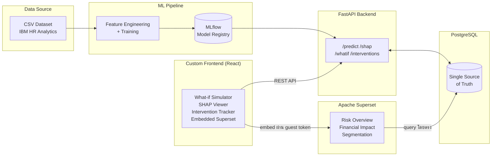
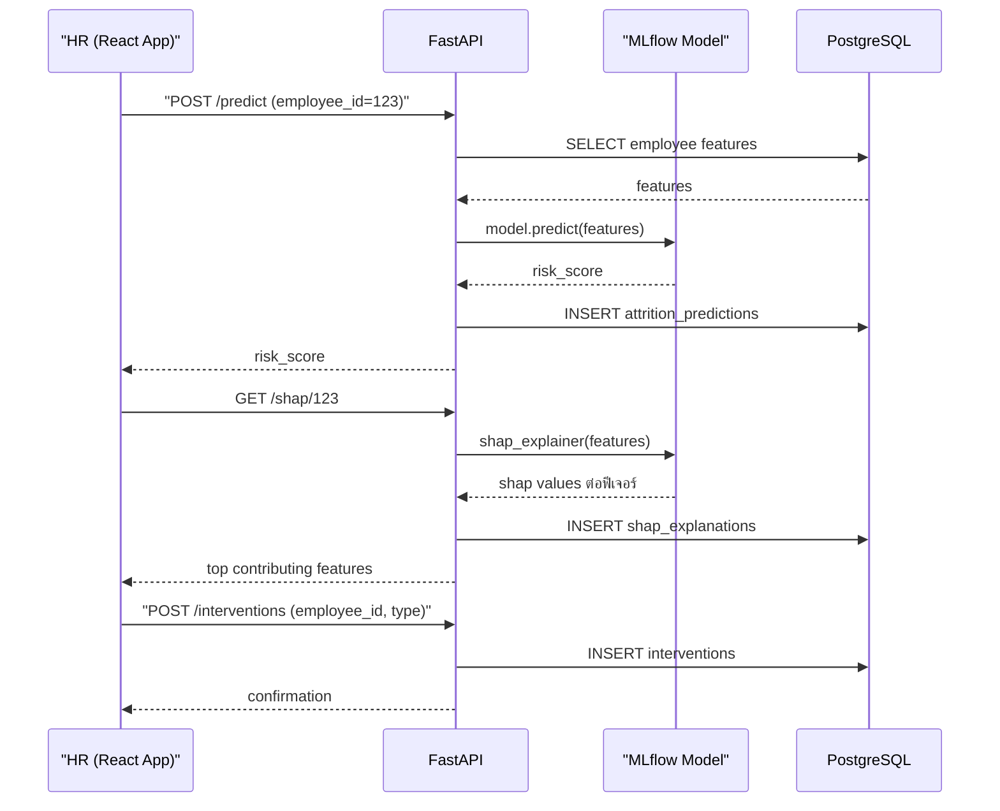

# Employee Attrition Predictor & HR Analytics Platform: Design Blueprint

เวอร์ชัน: v0.2 (Prototype in development, wk2–3 Modeling)
อัปเดตล่าสุด: 1 ต.ค. 2026

> เอกสารนี้เป็น Living Document ทีมเขียนขึ้นก่อนเริ่มพัฒนาเพื่อใช้เป็นแนวทางร่วมกัน และอัปเดตให้ตรงกับของจริงทุกครั้งที่ phase หนึ่งเสร็จ ตอนนี้บางส่วน implement แล้ว (ดู "สถานะปัจจุบัน" ด้านล่าง) ส่วนที่เหลือ เช่น Data Model/database กลาง, Superset dashboard และ authentication ยังเป็น "แผน"

---

## บริบทโปรเจกต์ (Project Context)

- ประเภทโปรเจกต์: งานนักศึกษาชั้นปีที่ 4 เทอม 1 สาขาวิทยาการคอมพิวเตอร์ (Proposal Defense) ของ School of Information Technology (SIT), Sripatum University (SPU)
- ระยะเวลาพัฒนา: ทีมทำงานหลัก 9 สัปดาห์ (22 ก.ย. – 23 พ.ย. 2026) + buffer ก่อน Final Exam จริงของรายวิชา (course week 15–16, ~24 พ.ย.–7 ธ.ค. 2026) ดูรายละเอียดที่ [10. Project Timeline](#10-project-timeline-แผนดำเนินงาน)
- สถานะปัจจุบัน: อยู่ใน wk2–3 (Modeling) ตอนนี้มี clean/feature pipeline, โมเดลสุดท้าย `attrition-xgboost-P` v1 บน MLflow (DagsHub), FastAPI (`/predict`, `/whatif`, `/shap`, `/financial-impact`, `/recalibrate`, `/company-summary`, `/company-summary/top-employees`), React (ภาพรวมบริษัท, SHAP Viewer, What-if Simulator, นำเข้าข้อมูล), PostgreSQL ของแอป (ไม่บังคับ), login แบบบัญชีทดลอง และ CI แล้ว ยังไม่มี Superset และระบบผู้ใช้จริง
- ขอบเขต: ระบบต้นแบบ (Prototype) บน IBM HR Analytics Employee Attrition & Performance dataset (Kaggle) ซึ่งเป็นข้อมูลจำลอง (synthetic) ไม่ใช่ข้อมูลองค์กรจริง ผลลัพธ์และสมมติฐานทางธุรกิจในเอกสารนี้จึงมีข้อจำกัดตามนั้น

---

## Setup Guide

> คู่มือรันแบบละเอียดทีละขั้น (ติดตั้งครั้งแรก, รันทุกวัน, database, แก้ปัญหาที่เจอบ่อย) อยู่ที่ [docs/run_guide.md](docs/run_guide.md)

ขั้นตอนด้านล่างรันได้จริงกับโค้ดปัจจุบัน (v0.2) ส่วนที่ยังไม่มี เช่น database ของแอปและ Superset จะเพิ่มเมื่อทำเสร็จ

### โปรแกรมที่ใช้ (Prerequisites)

| โปรแกรม | เวอร์ชัน | ใช้สำหรับ |
| :--- | :--- | :--- |
| [Python](https://www.python.org/) | 3.13.11 | ML/Data pipeline (data cleaning, feature engineering, training) + FastAPI backend |
| [Node.js](https://nodejs.org/) | v24.21.0 (LTS) | React frontend |
| [Docker](https://www.docker.com/) + Docker Compose v2 | Docker Desktop หรือ Docker Engine | รัน PostgreSQL + MLflow แบบ self-host (ไม่บังคับ ถ้าใช้ MLflow บน DagsHub) |
| [PostgreSQL](https://www.postgresql.org/) | 17 (image `postgres:17-alpine` ใน docker compose ไม่ต้องติดตั้งเอง) | ตอนนี้ใช้เก็บข้อมูลของ MLflow แบบ self-host ส่วน database ของแอปยังเป็นแผน (Backend phase wk6–7) |

### โครงสร้างโปรเจกต์

```
employee-attrition-predictor/
├── data/
│   ├── raw/               # IBM HR CSV ต้นฉบับ (read-only)
│   ├── processed/         # ผล cleaning ที่เก็บไว้เทียบ (pipeline คำนวณใหม่จาก raw ทุกครั้ง)
│   └── sample/            # พนักงานตัวอย่างสำหรับหน้า What-if
├── notebooks/             # EDA, cleaning, tuning, model lab (ลงท้าย _P = Puripat, _S = Saphondanai)
├── src/                   # pipeline ข้อมูล→โมเดล: clean_pipeline, feature_pipeline, train.py,
│                          #   shap_explain, business_rules, company_summary, mlflow_setup
│                          #   + หน้าทดสอบ Streamlit (test_app.py, app_pages/)
├── backend/               # FastAPI app (main.py, routers/, schemas.py) + pytest
├── frontend/              # React + Vite + Tailwind: ภาพรวมบริษัท, SHAP Viewer, What-if Simulator
├── config/                # financial_impact.json (ค่าตามกฎหมายแรงงานไทย + สมมติฐานธุรกิจ)
├── docker/                # Dockerfile ของ MLflow + init script ของ PostgreSQL
├── docs/                  # dataset card, วิธีตั้งค่า MLflow, รายงานร่าง, รายงาน review, Model Lab
├── .github/               # CI (GitHub Actions) + Dependabot
├── docker-compose.yml     # PostgreSQL + MLflow แบบ self-host
├── requirements.txt       # แพ็กเกจที่ใช้ตอนรันจริง
├── requirements-dev.txt   # + notebook, test, lint
├── TASKS.md               # checklist งานรายคน
└── CONTRIBUTING.md        # กติกาการเขียน commit message
```

> ยังไม่มี: `superset/` และ database ของแอป (แผน wk6–9 ดู [10. Project Timeline](#10-project-timeline-แผนดำเนินงาน))

### ขั้นตอน Clone

```bash
git clone https://github.com/InkSpuDek66/employee-attrition-predictor.git
cd employee-attrition-predictor
```

### สร้าง virtual environment (ทำครั้งเดียว)

ติดตั้งแพ็กเกจลง `.venv` ของโปรเจกต์ ไม่ลง Python หลักของเครื่อง เพื่อให้ทุกคนใช้ชุดเดียวกันและไม่ชนกับโปรเจกต์อื่น (`.venv` อยู่ใน `.gitignore` แล้ว)

```bash
python -m venv .venv
.venv\Scripts\activate            # Windows (macOS/Linux: source .venv/bin/activate)
pip install -r requirements-dev.txt
```

- เปิด terminal ใหม่ทุกครั้งต้อง `activate` ก่อนรันคำสั่ง Python ของโปรเจกต์ (ขึ้น `(.venv)` หน้าบรรทัด)
- VS Code: `Ctrl+Shift+P` → **Python: Select Interpreter** → เลือก `.venv` และเลือก kernel ของ notebook เป็น `.venv` ด้วย
- ไฟล์แพ็กเกจมี 2 ไฟล์ และทุกบรรทัด pin เวอร์ชันด้วย `==` ให้ทุกเครื่องและ CI ได้ชุดเดียวกัน
  - `requirements.txt` เฉพาะที่ใช้ตอนรันจริง (pipeline + backend)
  - `requirements-dev.txt` ดึง `requirements.txt` มาด้วย แล้วเพิ่ม notebook, test, lint
- เพิ่มแพ็กเกจใหม่ให้ใส่ `ชื่อ==เวอร์ชัน` (ดูเวอร์ชันจาก `pip freeze`) ลงไฟล์ที่ตรงกับการใช้งาน แล้ว commit เพื่อนจะได้ติดตั้งตาม
- หลังดึงโค้ดที่เปลี่ยนไฟล์แพ็กเกจ ให้รัน `pip install -r requirements-dev.txt` ใหม่

### ตั้งค่า MLflow (เลือก 1 แบบ)

backend โหลดโมเดลจาก MLflow Model Registry จึงต้องตั้ง `.env` ก่อน (`cp .env.example .env`)

- DagsHub (ทีมใช้ช่วงพัฒนา): ใส่ `MLFLOW_TRACKING_URI`, ชื่อผู้ใช้ และ token ของตัวเอง ตามขั้นตอนใน [docs/mlflow_setup.md](docs/mlflow_setup.md) โมเดลสุดท้าย `models:/attrition-xgboost-P/1` อยู่บนนั้นแล้ว ไม่ต้องเทรนเอง
- Self-host ด้วย docker compose: ตั้ง `POSTGRES_PASSWORD` และ `MLFLOW_TRACKING_URI=http://localhost:5000` แล้วรัน
  ```bash
  docker compose up -d --build --wait
  python src/train.py               # เทรน + register โมเดล แล้วตั้ง MODEL_URI ใน .env ตามที่พิมพ์ออกมา
  ```

> MLflow บน DagsHub ของทีมเป็นสาธารณะ ห้ามใช้กับข้อมูลพนักงานจริง (รายละเอียดใน [docs/mlflow_setup.md](docs/mlflow_setup.md))

### รันระบบ

แต่ละข้อเปิดใน terminal ของตัวเอง เริ่มจากรากโปรเจกต์ (ข้อ 1 และ 3 ต้อง activate `.venv` ก่อน)

```bash
# 1) Backend (FastAPI) → http://localhost:8000/docs
cd backend
uvicorn main:app --reload

# 2) Frontend (React) → http://localhost:5173  (เรียก backend ผ่าน /api ที่ Vite proxy ไป port 8000)
cd frontend
npm install                        # ครั้งแรก
npm run dev

# 3) หน้าทดสอบ Streamlit สำหรับทีม (ไม่บังคับ)
streamlit run src/test_app.py --server.address localhost
```

### หน้าเว็บ (React)

| แท็บ | ใช้ทำอะไร | API ที่เรียก |
| :--- | :--- | :--- |
| ภาพรวมบริษัท | ตัวเลขสรุป สัดส่วนระดับความเสี่ยง ปัจจัยหลักพร้อมคำแนะนำ ตารางแยกแผนก รายชื่อเสี่ยงสูงสุด (กดเลือกได้ ดาวน์โหลด CSV ได้) | `/company-summary`, `/company-summary/departments`, `/company-summary/top-employees` |
| SHAP Viewer | คะแนนของพนักงานหนึ่งคน สรุปเป็นประโยค กราฟ/ตารางปัจจัย | `/shap/{id}` |
| What-if Simulator | ปรับเงื่อนไขแล้วเห็นคะแนนใหม่ทันที มาตรการสำเร็จรูป บันทึกผลไว้เทียบ ต้นทุน Retain vs Replace พร้อมสูตร | `/whatif`, `/financial-impact/{id}` |
| ปรับเทียบโมเดล (เฉพาะผู้ดูแลระบบ) | อัปโหลดไฟล์พนักงานในอดีตพร้อมผลว่าลาออกหรือยัง แล้วปรับสเกลคะแนนให้ตรงกับบริษัท (README 6.5) ดูผลก่อน/หลัง ประวัติ และยกเลิกได้ มีไฟล์ข้อมูลทดลอง 300 คนไว้ demo | `/recalibrate/*` |
| นำเข้าข้อมูล | ดาวน์โหลดไฟล์ Excel ตัวอย่าง อัปโหลดไฟล์พนักงานแล้วดูว่าคอลัมน์/แถวไหนผิด ผู้ดูแลระบบกดบันทึกลง database ได้เมื่อไฟล์ผ่านทุกแถว แล้วกดดูพนักงานที่เพิ่งเพิ่มได้ทันที (ใช้ข้อมูลทดสอบเท่านั้น) | `/employees/template`, `/employees/validate`, `/employees/import` |

- เงินในหน้าเว็บเป็นบาท โดยถือว่า `MonthlyIncome` ใน IBM dataset เป็นดอลลาร์ (แนวเดียวกับหน้า Streamlit) อัตราคงที่ 35 บาท/ดอลลาร์ (`THB_PER_USD` ใน `frontend/src/theme.js`) ผู้ใช้ปรับไม่ได้และไม่เห็นดอลลาร์ ส่งเข้าโมเดลเป็นดอลลาร์จำนวนเต็ม ระยะทางแสดงเป็น กม. (IBM ไม่ได้ระบุหน่วย) ตาม DE-01 ควรย้ายการแปลงไป backend/config ที่เดียวภายหลัง
- ต้องเข้าสู่ระบบก่อน ตอนนี้เป็นบัญชีทดลองชั่วคราว (แสดงบนหน้า login): `hr_demo` / `hr-demo-1234` (ฝ่ายบุคคล) และ `admin_demo` / `admin-demo-1234` (ผู้ดูแลระบบ: บันทึกไฟล์นำเข้า + ปรับเทียบโมเดลได้) บริษัทมาจากบัญชีที่ login ไม่มีช่องให้พิมพ์รหัสบริษัทแล้ว (SEC-02)
- ลิงก์แชร์ได้: แท็บ/รหัสพนักงานอยู่ใน URL เช่น `http://localhost:5173/?tab=whatif&id=5` ปุ่ม back ใช้ได้
- เกณฑ์ระดับความเสี่ยง (40/70) อยู่ทั้ง `src/business_rules.py` และ `frontend/src/theme.js` มี test (`backend/test_business_rules.py`) เช็กว่าตรงกัน แก้ต้องแก้คู่กัน
- มีโหมดมืด (ปุ่มมุมบนซ้าย) และผู้ช่วยตัวการ์ตูนใน sidebar ที่เปลี่ยนท่าตามระดับความเสี่ยง (เป็นของตกแต่ง ข้อมูลจริงอยู่ที่ตัวเลขในหน้า)
- SHAP Viewer โหลดแยกไฟล์ (recharts ก้อนใหญ่) หน้าแรกจึงเปิดเร็ว

### Test และ CI

```bash
ruff check .
python -m pytest backend          # โหลดโมเดลจาก MLflow ตาม .env
cd frontend && npm run lint && npm test && npm run build   # npm test = node:test ไม่ต้องลง library เพิ่ม
```

ทุก Pull Request และทุก push เข้า `main` จะรัน CI ([.github/workflows/ci.yml](.github/workflows/ci.yml)) ดังนี้
- lint ด้วย ruff และ oxlint
- สแกนช่องโหว่ของแพ็กเกจด้วย pip-audit และ npm audit
- เปิด PostgreSQL + MLflow ด้วย docker compose แล้วเทรนโมเดลใหม่ (fail ถ้า test AUC < 0.75)
- รัน backend test, frontend test และ build frontend

> ยังไม่มี container ของ backend/frontend และ migration ของ database แอป (แผน Backend phase wk6–7)

---

## สารบัญ

1. [System Overview](#1-system-overview-ภาพรวมระบบ)
2. [Team & Working Model](#2-team--working-model-ทีมและรูปแบบการทำงาน)
3. [Core Workflow](#3-core-workflow-predict--explain--act--measure)
4. [Dataset](#4-dataset)
5. [Data Model (High-level)](#5-data-model-high-level-แผนออกแบบข้อมูล)
6. [Business Logic Rules](#6-business-logic-rules)
7. [API Design](#7-api-design-fastapi)
8. [Tech Stack](#8-tech-stack)
9. [System Architecture](#9-system-architecture)
10. [Project Timeline](#10-project-timeline-แผนดำเนินงาน)
11. [Risks & Mitigation](#11-risks--mitigation)
12. [Expected Outcomes](#12-expected-outcomes)

---

## 1. System Overview (ภาพรวมระบบ)

HR ส่วนใหญ่รู้ว่าพนักงานจะลาออก "หลัง" จากที่เขาตัดสินใจไปแล้ว ทำให้ขาดโอกาสดูแลหรือรักษาคนไว้ทัน องค์กรจึงต้องแบกต้นทุนสรรหา/ฝึกอบรมคนใหม่ซ้ำ ๆ (เฉลี่ย 50–200% ของเงินเดือน 1 ปีต่อคน)

โปรเจกต์นี้สร้างระบบที่ทำให้ HR รู้ปัญหาเร็วขึ้น ระบบพยากรณ์ความเสี่ยงรายบุคคล อธิบายเหตุผลของคะแนน แปลงความเสี่ยงเป็นตัวเลขต้นทุนเพื่อใช้ตัดสินใจ และติดตามผลของมาตรการที่ทำไป ทั้งหมดอยู่ในเว็บแอปที่ HR ใช้งานได้ ไม่ได้จบแค่โมเดลใน notebook

### Key Objectives

1. Risk Prediction: พยากรณ์ความเสี่ยงลาออกรายบุคคลด้วย Machine Learning (XGBoost)
2. Explainability (XAI): ใช้ SHAP อธิบายว่าทำไมพนักงานคนนั้นเสี่ยง นอกเหนือจากตัวเลข probability
3. Financial Impact: แปลงความเสี่ยงเป็นมูลค่าธุรกิจ เปรียบเทียบ Retain vs Replace เพื่อช่วยจัดลำดับความสำคัญ
4. Actionable System: Dashboard และ Intervention Tracker ที่ HR ใช้ติดตามและวัดผลมาตรการ
5. Organization-wide Insight: รวม SHAP ทั้งบริษัทหรือรายแผนกเพื่อสรุปปัจจัยเสี่ยงเด่น ให้ HR จัดลำดับนโยบายระดับองค์กรได้โดยไม่ต้องไล่ดูทีละคน

---

## 2. Team & Working Model (ทีมและรูปแบบการทำงาน)

กลุ่ม 38 เอเอ๊สกักะดุ๊งกะดิง | School of Information Technology (SIT), Computer Science, SPU

| รหัสนักศึกษา | ชื่อ |
| :--- | :--- |
| 66080853 | Miss. Yanisa Intharawicha |
| 66076195 | Mr. Saphondanai Chuechan |
| 66079943 | Mr. Puripat Wongtangton |
| 66083478 | Miss. Nanthamon Supo |

รูปแบบการทำงาน: ทั้งทีม 4 คนทำงาน phase เดียวกันพร้อมกันตาม [Timeline](#10-project-timeline-แผนดำเนินงาน) แทนการแบ่งสายงานตายตัวรายบุคคล เพื่อให้ทุกคนมีส่วนร่วมและเข้าใจทุกส่วนของระบบ (ไม่มี owner ประจำโมดูลใดโมดูลหนึ่งแบบถาวร)

---

## 3. Core Workflow: Predict → Explain → Act → Measure

ระบบออกแบบเป็นวงจรปิด (closed loop) ผลจากขั้นสุดท้ายย้อนกลับไปปรับขั้นแรก:

```
1. Predict  → FastAPI /predict อ่าน feature ของพนักงานจาก PostgreSQL
              → เรียกโมเดล XGBoost (โหลดจาก MLflow) → คืนค่า risk_score

2. Explain  → FastAPI /shap คำนวณ SHAP values ของพนักงานคนนั้น
              → ส่งค่า contribution รายฟีเจอร์ให้ frontend แสดงผล

3. Act      → HR ดู risk_score + SHAP + financial impact บน React app
              → เลือกมาตรการ (เช่น ปรับเงินเดือน, ลด OT, ให้ stock option)
              → บันทึกเป็น intervention ผ่าน POST /interventions

4. Measure  → ระบบติดตาม outcome ของ intervention ตามช่วงเวลาที่กำหนด
              → ผลใช้ปรับปรุงโมเดลและมาตรการในรอบถัดไป (retrain / re-evaluate)
```

What-if Simulator เป็นส่วนหนึ่งของขั้น Act ผู้ใช้ปรับค่าฟีเจอร์สมมติ (เช่น เพิ่มเงินเดือน, ลด OT) ผ่าน frontend → เรียก `POST /whatif` → ระบบคำนวณ risk_score ใหม่แบบ real-time โดยไม่บันทึกลง database (ใช้ประกอบการตัดสินใจก่อนทำ intervention จริง)

Company-wide Aggregate Summary ต่อยอดจากขั้น Explain นอกจาก SHAP รายบุคคล ระบบรวมค่า SHAP เฉลี่ยของพนักงานทั้งบริษัท/ตามแผนก เพื่อสรุปให้ HR เห็นภาพรวมว่า "ปัจจัยอะไรเป็นตัวขับความเสี่ยงลาออกสูงสุดทั้งองค์กร" พร้อมคำแนะนำเชิงนโยบายแบบ rule-based (เช่น ถ้า OT เป็นปัจจัยอันดับ 1 ทั้งบริษัท → แนะนำทบทวนนโยบาย OT) ผ่าน `GET /company-summary` (ดู [6.6](#66-company-wide-aggregate-summary))

---

## 4. Dataset

IBM HR Analytics Employee Attrition & Performance (Kaggle Open Dataset)

| รายการ | ค่า |
| :--- | :--- |
| จำนวนแถว | 1,470 (พนักงาน 1,470 คน) |
| จำนวนคอลัมน์ | 35 ฟีเจอร์ (ตัวเลข + หมวดหมู่) |
| Target column | `Attrition` (Yes/No) |
| อัตราลาออกในชุดข้อมูล | 16.1% (237 คน) ข้อมูลไม่สมดุล ต้องพิจารณา class imbalance ตอนเทรน |

ผลจาก EDA เบื้องต้น (ใช้กำหนดทิศทาง feature engineering ใน Modeling phase):

- ฟีเจอร์ที่สัมพันธ์กับการลาออกชัดสุด: `OverTime` (ลาออก 30.5% เทียบ 10.4% ของคนไม่ทำ OT), `JobRole` (Sales Representative สูงสุด 39.8%)
- กลุ่มฟีเจอร์ที่คาดว่าทำนายได้ดี: `MonthlyIncome`, `Age`, `OverTime`, `TotalWorkingYears`, `YearsAtCompany`, `DistanceFromHome`, `StockOptionLevel`
- ความเสี่ยง Data Leakage: ต้องตรวจสอบ timeline ของแต่ละฟีเจอร์ก่อนใช้เทรน (ดู [11. Risks](#11-risks--mitigation))

### ที่มาและสัญญาอนุญาต (License)

- แหล่งข้อมูล: [Kaggle: pavansubhasht/ibm-hr-analytics-attrition-dataset](https://www.kaggle.com/datasets/pavansubhasht/ibm-hr-analytics-attrition-dataset) อัปเดตล่าสุด 31 มี.ค. 2017 คำอธิบายบน Kaggle ระบุว่าเป็น *"a fictional data set created by IBM data scientists"*
- License: [ODbL v1.0](https://opendatacommons.org/licenses/odbl/1-0/) สำหรับตัวฐานข้อมูล และ [DbCL v1.0](https://opendatacommons.org/licenses/dbcl/1-0/) สำหรับเนื้อหา ใช้เชิงพาณิชย์ได้ แต่ต้องให้เครดิตที่มาทุกที่ที่เผยแพร่ผลงาน (รายงาน สไลด์ เว็บ) และถ้าเผยแพร่ข้อมูลที่ดัดแปลงแล้ว (`data/processed/`) ต้องใช้ ODbL เหมือนกัน (share-alike)
- ผลต่อแต่ละส่วนของโปรเจกต์ ข้อความเครดิตสำเร็จรูป และความหมายของคอลัมน์ที่เป็นรหัส ดูที่ [docs/dataset.md](docs/dataset.md)

### การปรับให้เหมาะกับบริบทไทย (Localization Notes)

ค้นแล้วไม่พบ dataset การลาออกของพนักงานไทยที่เปิดเผยต่อสาธารณะ (ทางเลือกที่พิจารณาแล้วไม่เลือก คือ dataset สำรวจพนักงานซาอุดีอาระเบียจาก Data in Brief 2025 ซึ่งประเทศไม่ตรง และการเก็บ survey พนักงานไทยเอง ซึ่งใช้เวลาเกินกรอบ 9 สัปดาห์) จึงยังใช้ IBM dataset เป็นชุดข้อมูลหลักในการเทรน และจัดการความเสี่ยงเรื่อง cross-cultural transferability ดังนี้:

- ทดลองตัดฟีเจอร์ที่อาจไม่ transfer ข้ามวัฒนธรรม คือ `BusinessTravel` (โครงสร้างการเดินทางธุรกิจแบบอเมริกัน) และ `StockOptionLevel` (พบน้อยในบริษัท/SME ไทย) ใน `notebooks/04_tuning_S.ipynb` โดยตั้งกติกาก่อนดูผลว่าจะตัดถ้า CV PR-AUC ลดไม่เกิน 0.01 ผลคือลดลง 0.02–0.035 จึงคงไว้ในโมเดลสุดท้าย แล้วจัดการด้วย recalibration และคำแนะนำแบบไทยแทน (เช่น `StockOptionLevel` แนะนำเป็นการสมทบกองทุนสำรองเลี้ยงชีพ) ผลเต็มอยู่ใน [รายงานร่าง Business Logic](docs/report_business_logic_draft_S.md) หัวข้อ 2
- โมเดลสุดท้าย (`attrition-xgboost-P` v1) ใช้คอลัมน์เดิมทั้งหมด ยกเว้น 4 คอลัมน์ที่ไม่มีข้อมูล (`EmployeeCount`, `StandardHours`, `Over18`, `EmployeeNumber`) บวกฟีเจอร์ใหม่ 3 ตัว (`OverTimeXDistance`, `AvgSatisfaction`, `TenureRatio`) รวม 50 คอลัมน์หลัง one-hot
- ข้อจำกัดที่ยังค้างอยู่คือ IBM ไม่ระบุสกุลเงินของ `MonthlyIncome` ถ้าบริษัทไทยส่งเงินเดือนเป็นบาท คะแนนความเสี่ยงจะผิด รอทีมตกลงหน่วยกลาง (DE-01 ใน [review Data Engineering](docs/review_data_engineering_S.md))
- ดู [6.5 Model Localization](#65-model-localization-เพื่อให้ใช้ในไทยได้จริง) สำหรับกลไก recalibrate โมเดลด้วยข้อมูลจริงของบริษัทที่ใช้งาน

---

## 5. Data Model (High-level แผนออกแบบข้อมูล)

> ระดับ High-level เท่านั้น จะลง column/type ละเอียดตอนเริ่ม Backend phase (wk6–7) เมื่อ schema นิ่งแล้ว
>
> ทีมเลือกใช้ PostgreSQL ใน `docker-compose.yml` (database `attrition`, DE-04) schema อยู่ที่ [docker/postgres/init/02-app-schema.sql](docker/postgres/init/02-app-schema.sql) สร้างตารางอัตโนมัติตอน `docker compose up` ครั้งแรก (volume ใหม่) ถ้ามี volume อยู่แล้วให้รัน `docker compose exec -T postgres psql -v ON_ERROR_STOP=1 -U attrition -d attrition < docker/postgres/init/02-app-schema.sql`
> ทุกตารางที่เป็นข้อมูลบริษัทมี `tenant_id` (SEC-02) ผลทำนายมี `model_version` กับเวลา และ `employees` มี CHECK ช่วงค่าเท่ากับ IBM dataset (ทดสอบใส่ข้อมูล IBM ครบ 1,470 คนแล้ว) เงินเดือนเก็บเป็นหน่วยของโมเดลตาม DE-01
> ต่อ backend เข้า database แล้ว (ไม่บังคับ): ตั้ง `DATABASE_URL` ใน `.env` แล้ว backend อ่านพนักงานจากตาราง `employees` (tenant `ibm_demo`) แทน CSV โหลด IBM dataset ด้วย `python src/db.py` และให้คะแนนทุกคนลง `attrition_predictions`, `shap_explanations`, `financial_impact_estimates`, `company_risk_summary` ด้วย `python backend/batch_score.py` (วิธีละเอียดใน [docs/run_guide.md](docs/run_guide.md))
> ยังไม่ได้ย้าย: ผล recalibrate ยังเป็นไฟล์ JSON ใน `backend/calibrations/`, ปุ่มบันทึกของหน้านำเข้า Excel และให้ endpoint อ่าน cache `company_risk_summary`

| Entity | หน้าที่ | Key fields (แผน) |
| :--- | :--- | :--- |
| `employees` | Snapshot ข้อมูลพนักงานที่ import จาก dataset | employee_id, demographic/job features, department |
| `model_runs` | อ้างอิง MLflow experiment/version ที่ใช้งานอยู่ | run_id, model_version, metrics, trained_at |
| `attrition_predictions` | ผลพยากรณ์ล่าสุดต่อพนักงานต่อ model run | employee_id, run_id, risk_score, predicted_at |
| `shap_explanations` | ค่า contribution รายฟีเจอร์ของแต่ละ prediction | prediction_id, feature_name, shap_value |
| `financial_impact_estimates` | ประมาณการต้นทุน retain vs replace | employee_id, replacement_cost_estimate, retain_cost_estimate |
| `interventions` | มาตรการที่ HR เลือกทำ + ผลลัพธ์ (Act → Measure) | employee_id, intervention_type, started_at, outcome, measured_at |
| `tenant_calibrations` | ผล recalibration เฉพาะบริษัท (tenant) จากข้อมูลลาออกจริงที่อัปโหลด | tenant_id, calibration_method, sample_size, applied_at |
| `company_risk_summary` | Cache ผลสรุปความเสี่ยงรวมทั้งบริษัท/แผนก (อัปเดตเป็นรอบ) | department, top_risk_factors, avg_risk_score, generated_at |

ความสัมพันธ์คร่าว ๆ: `employees 1:N attrition_predictions`, `attrition_predictions 1:N shap_explanations`, `employees 1:N interventions`, `model_runs 1:N attrition_predictions`

---

## 6. Business Logic Rules

> 6.1, 6.3, 6.5 และ 6.6 implement แล้วใน `src/business_rules.py`, `src/company_summary.py` และ `config/financial_impact.json` ส่วน 6.4 ยังเป็นแผน กฎเชิงตัวเลข (threshold, cutoff) ทั้งหมดยังเป็นค่าตั้งต้น รอทีมทบทวนกับการกระจายของ risk_score จริง

### 6.1 Risk Banding
```
risk_score >= 0.7  → High Risk
0.4 <= risk_score < 0.7 → Medium Risk
risk_score < 0.4   → Low Risk
```
> กับโมเดล v1 พนักงาน 1,470 คนแบ่งได้ High 185 / Medium 274 / Low 1,011 คน (นับรวมแถวที่โมเดลเคยเห็นตอนเทรน) ถ้าบริษัท recalibrate แล้ว ระบบแบ่งระดับจากคะแนนที่ปรับเทียบแล้ว

### 6.2 Data Leakage Guard
```
ก่อนใช้ฟีเจอร์ใดเทรนโมเดล:
  -> ตรวจสอบว่าฟีเจอร์นั้นบันทึกค่า ณ เวลาใด
  -> ตัดฟีเจอร์ที่อาจเกิดขึ้น "หลัง" พนักงานตัดสินใจลาออกแล้วออกจาก training set
```

### 6.3 Financial Impact Estimate (อิงกฎหมายแรงงานไทย)
```
severance_pay = ตารางค่าชดเชยตาม พ.ร.บ.คุ้มครองแรงงาน มาตรา 118 (อิงอายุงาน)
  ตัวอย่างโครงสร้าง (ต้องตรวจสอบตัวเลขล่าสุดกับกฎหมายจริงก่อนใช้งานจริง):
    120 วัน – 1 ปี  = ค่าจ้าง 30 วัน
    1 – 3 ปี        = ค่าจ้าง 90 วัน
    3 – 6 ปี        = ค่าจ้าง 180 วัน
    6 – 10 ปี       = ค่าจ้าง 240 วัน
    10 – 20 ปี      = ค่าจ้าง 300 วัน
    20 ปีขึ้นไป      = ค่าจ้าง 400 วัน

replacement_cost_estimate = severance_pay (ถ้าเข้าเงื่อนไข) + recruitment_cost + training_cost
  (recruitment/training cost อ้างอิงเบนช์มาร์กสากล 0.5–2.0 เท่าของเงินเดือนปี ปรับตามตำแหน่ง
   เนื่องจากยังไม่มีเบนช์มาร์กไทยที่เชื่อถือได้)

retain_cost_estimate = ต้นทุนโดยประมาณของมาตรการรักษาคน (เช่น ปรับเงินเดือน, ลด OT)

ROI = replacement_cost_estimate - retain_cost_estimate
```
> ตารางค่าชดเชยเก็บเป็น config แยกจากโค้ดโมเดล (`config/financial_impact.json`) เพื่อให้อัปเดตตามกฎหมายที่เปลี่ยนแปลงได้โดยไม่ต้อง retrain
>
> ที่ implement จริง: ค่าเริ่มต้นไม่รวมค่าชดเชยในต้นทุนหาคนแทน เพราะมาตรา 118 จ่ายเมื่อนายจ้างเลิกจ้าง ส่วนพนักงานที่ลาออกเองไม่ได้รับ เปิดได้ด้วย `include_severance` (เหตุผลเต็มอยู่ใน [รายงานร่าง Business Logic](docs/report_business_logic_draft_S.md) หัวข้อ 4.3)

### 6.4 Fairness Check
```
ตรวจสอบ demographic parity / equal opportunity ของ risk_score
  ระหว่างกลุ่มตาม protected attribute (เพศ, ช่วงอายุ) ด้วย Fairlearn
  -> threshold ที่ยอมรับได้จะกำหนดใน Backend & Analysis phase (wk6–7)
```
> ยังไม่ได้ทำ ตัวเลขตั้งต้นจากคะแนน out-of-fold อยู่ใน DS-04 ของ [review Data Engineering](docs/review_data_engineering_S.md) (โมเดลจับคนลาออกอายุ 40 ปีขึ้นไปได้ไม่ถึงครึ่ง ขณะที่กลุ่มอายุ 18–29 จับได้ 79%)

### 6.5 Model Localization (เพื่อให้ใช้ในไทยได้จริง)
```
Deploy-time (per-tenant):
  ระบบเทรน "โมเดลกลาง" จาก IBM dataset (ดู 4. Dataset)
  เมื่อบริษัทไทยเริ่มใช้งานจริงและมีข้อมูลลาออกในอดีตของตัวเอง:
    -> อัปโหลดผ่าน POST /recalibrate
    -> ปรับ threshold/probability ของโมเดลกลางด้วย Platt scaling หรือ isotonic regression
       โดยใช้ label จริงของบริษัทนั้น (ไม่ retrain โมเดลทั้งก้อนใหม่)
    -> บันทึกผลลง tenant_calibrations แยกต่อบริษัท

ผลลัพธ์: risk_score เชิงอันดับ (ranking) และ SHAP ยังอิง pattern จาก IBM dataset
         แต่ threshold ตัดสิน High/Medium/Low จะปรับเข้ากับพฤติกรรมจริงของบริษัทนั้นได้
```
> ตราบใดที่บริษัทยังไม่ได้ recalibrate ระบบต้องแสดงคำเตือนกำกับ risk_score ว่า "ยังไม่ได้ปรับเทียบกับข้อมูลจริงของบริษัท — ใช้ SHAP (ทิศทางของปัจจัย) ประกอบการตัดสินใจมากกว่าเชื่อตัวเลขตรงๆ" เพื่อความโปร่งใส
>
> ที่ implement จริง: `POST /recalibrate` รองรับ Platt scaling และ isotonic regression เรียกได้เฉพาะผู้ดูแลระบบและปรับได้เฉพาะบริษัทของตัวเอง endpoint ที่คืนคะแนนใช้บริษัทของผู้ login และแนบคำเตือนข้างบนเมื่อบริษัทยังไม่ได้ปรับเทียบ ผลการปรับเทียบเก็บในตาราง `tenant_calibrations` (ไม่ต่อ DB = ไฟล์ JSON) login ตอนนี้เป็นบัญชีทดลอง จึงห้ามใช้กับข้อมูลจริง (ดู [review Security](docs/review_security_S.md))

### 6.6 Company-wide Aggregate Summary
```
รอบคำนวณ (เช่น รายสัปดาห์ หรือ on-demand ผ่าน GET /company-summary):
  -> ดึง shap_explanations ของพนักงานทั้งหมด (หรือกรองตามแผนก)
  -> คำนวณ mean(|shap_value|) แยกตาม feature_name -> จัดอันดับปัจจัยเสี่ยงเด่นสุด
  -> จับคู่กับ rule-based recommendation table เช่น
       OT สูงสุด            -> "ทบทวนนโยบาย OT / ภาระงาน"
       WorkLifeBalance ต่ำสุด -> "พิจารณาสวัสดิการ/ความยืดหยุ่นเวลาทำงาน"
       MonthlyIncome ต่ำ     -> "ทบทวนโครงสร้างเงินเดือนเทียบตลาด"
  -> รวมกับ financial_impact_estimates เพื่อประเมิน "มูลค่าที่ประหยัดได้โดยประมาณ" ถ้าแก้ปัจจัยนั้น
  -> บันทึกผลลง company_risk_summary (cache ไว้ ไม่คำนวณสดทุกครั้งที่มีคนเปิด dashboard)
```
> ที่ implement จริง: `src/company_summary.py` รวม SHAP ของคอลัมน์ one-hot กลับเป็นฟีเจอร์เดิมก่อนจัดอันดับ และแยกปัจจัยที่บริษัทปรับได้ออกจากข้อมูลส่วนตัว (อายุ, เพศ, สถานภาพ) ตอนนี้ `GET /company-summary` คำนวณสดทุก request และยังไม่ cache ลง `company_risk_summary` (รอ database ของแอป)
>
> ข้อควรระวัง: SHAP บอกความสัมพันธ์กับโมเดล ไม่ได้พิสูจน์ว่าเป็นเหตุเป็นผล คำแนะนำทั้งหมดจึงต้องใช้ถ้อยคำเชิงทิศทาง ("น่าจะช่วยลดความเสี่ยง") ไม่รับประกันผล ตามหลักความโปร่งใสเดียวกับ [6.5](#65-model-localization-เพื่อให้ใช้ในไทยได้จริง)

---

## 7. API Design (FastAPI)

> "ทำแล้ว" คือมีใน `backend/routers/` แล้ว ดู request/response จริงได้ที่ http://localhost:8000/docs ตอนรัน backend ส่วน "แผน" จะทำใน Backend phase (wk6–7)

| สถานะ | Method | Endpoint | หน้าที่ |
| :---: | :--- | :--- | :--- |
| ทำแล้ว | POST | `/auth/login` | เข้าสู่ระบบ คืน token (แนบ `Authorization: Bearer` ทุก request) ตอนนี้เป็นบัญชีทดลอง |
| ทำแล้ว | POST | `/predict` | รับ `employee_id` (มีในระบบ) หรือข้อมูลพนักงานทั้งก้อน → คืน risk_score และ risk band |
| ทำแล้ว | GET | `/shap/{employee_id}` | คืน SHAP explanation ของพนักงานคนนั้น |
| ทำแล้ว | POST | `/whatif` | จำลองการเปลี่ยนฟีเจอร์ → คืน risk_score ใหม่ (ไม่บันทึกลง DB) |
| ทำแล้ว | GET | `/financial-impact/{employee_id}` | คืนประมาณการต้นทุน retain vs replace |
| ทำแล้ว | POST | `/recalibrate` | อัปโหลดข้อมูลลาออกจริงของบริษัท (tenant) เพื่อปรับคะแนนให้เข้ากับพฤติกรรมจริง (ดู [6.5](#65-model-localization-เพื่อให้ใช้ในไทยได้จริง)) |
| ทำแล้ว | GET / POST | `/recalibrate/template`, `/recalibrate/upload` | ไฟล์ Excel ตัวอย่าง (มีข้อมูลทดลอง 300 คน) และปรับเทียบจากไฟล์ Excel/CSV หัวคอลัมน์ไทย (เฉพาะผู้ดูแลระบบ) |
| ทำแล้ว | GET / DELETE | `/recalibrate/history`, `/recalibrate` | ประวัติการปรับเทียบของบริษัท และยกเลิกการปรับเทียบ (กลับไปใช้คะแนนของโมเดลกลาง) |
| ทำแล้ว | GET | `/company-summary` | สรุปปัจจัยเสี่ยงเด่นทั้งบริษัท/แผนก พร้อมคำแนะนำเชิงนโยบาย (ดู [6.6](#66-company-wide-aggregate-summary)) |
| ทำแล้ว | GET | `/company-summary/departments` | สรุปทุกแผนกในครั้งเดียว เรียงตามมูลค่าความเสี่ยงรวม |
| ทำแล้ว | GET | `/employees/template` | ไฟล์ Excel ตัวอย่างสำหรับนำเข้าพนักงาน (หัวคอลัมน์ไทย + ชีตคำอธิบาย) |
| ทำแล้ว | POST | `/employees/validate` | ตรวจไฟล์ Excel/CSV ที่อัปโหลด คืนคอลัมน์ที่ขาดและแถวที่ผิดเป็นภาษาไทย (ยังไม่บันทึก) |
| ทำแล้ว | POST | `/employees/import` | ตรวจแล้วบันทึกลงตาราง `employees` (เฉพาะผู้ดูแลระบบ ต้องต่อ database และไฟล์ต้องผ่านทุกแถว) |
| ทำแล้ว | GET | `/company-summary/top-employees` | พนักงานเสี่ยงสูงสุด n คน (กรองแผนกได้, บริษัทที่ปรับเทียบแล้วใช้คะแนนปรับเทียบ) ให้หน้าเว็บกดเลือกโดยไม่ต้องรู้รหัส |
| แผน | GET | `/health` | Health check |
| แผน | POST | `/interventions` | บันทึกมาตรการที่ HR เลือกทำกับพนักงาน |
| แผน | GET | `/interventions/{employee_id}` | ดูประวัติมาตรการของพนักงานคนนั้น |
| แผน | GET | `/dashboard/summary` | ข้อมูลสรุปสำหรับ Superset/React dashboard |
| แผน | GET | `/calibration-status/{tenant_id}` | ตรวจสอบว่าบริษัทนี้ recalibrate โมเดลแล้วหรือยัง |

> ทุก endpoint ต้อง login (`backend/auth.py` ครอบทุก router ใน `main.py`) ไม่มี token ได้ 401 ส่ง `tenant_id` ของบริษัทอื่นได้ 403 มี rate limit และเพดานขนาด body (SEC-01/02/03) แต่บัญชียังเป็นบัญชีทดลองที่เขียนไว้ในโค้ด จึงรันได้เฉพาะในเครื่องกับข้อมูลสมมติ ก่อน deploy ต้องมีระบบผู้ใช้จริง (ตาราง users + hash รหัสผ่าน) ตามที่ทีมตกลงใน SEC-01 ([review Security](docs/review_security_S.md))

---

## 8. Tech Stack

| ส่วนประกอบ | เทคโนโลยี | หน้าที่ | สถานะ |
| :--- | :--- | :--- | :--- |
| BI / Dashboard | Apache Superset | Dashboard สรุปเชิงบริหาร ต่อ PostgreSQL โดยตรง | แผน (wk8–9) |
| Frontend | React 19 + Vite + Tailwind CSS 4 + Recharts | ภาพรวมบริษัท, What-if Simulator, SHAP viewer, Intervention Tracker | ภาพรวมบริษัท + What-if + SHAP viewer ใช้ได้แล้ว (ดู [หน้าเว็บ](#หน้าเว็บ-react)) |
| หน้าทดสอบ | Streamlit | หน้าทดสอบภายในทีม (`src/test_app.py`) ไม่ใช่ตัวผลิตภัณฑ์ | ใช้ได้แล้ว |
| Backend | FastAPI + Pydantic | Serve model, API endpoints, business logic | ใช้ได้แล้ว (ดู [7](#7-api-design-fastapi)) |
| ML / Data | pandas, Scikit-learn, XGBoost, SHAP, Optuna | Feature engineering, เทรนและจูนโมเดล, อธิบายผลลัพธ์ | ใช้ได้แล้ว |
| Model Tracking | MLflow | Version model, เปรียบเทียบ experiment | DagsHub (ช่วงพัฒนา) หรือ self-host ด้วย docker compose |
| Database | PostgreSQL | Source of truth ตัวเดียวทั้งระบบ | ตอนนี้ใช้กับ MLflow self-host, database ของแอปยังเป็นแผน |
| CI / คุณภาพโค้ด | GitHub Actions, ruff, oxlint, pytest, pip-audit, npm audit | lint, test, เทรนซ้ำ และสแกนช่องโหว่ทุก PR | ใช้ได้แล้ว |
| Deploy | Docker Compose + Render | Containerize และ deploy ทุกส่วน | แผน |

---

## 9. System Architecture

สถาปัตยกรรมแบบ Hybrid: Apache Superset (สำหรับ BI เชิงบริหาร) + Custom App (React + FastAPI สำหรับ interactive features)


```mermaid
flowchart LR
    subgraph DS["Data Source"]
        A["CSV Dataset<br/>IBM HR Analytics"]
    end

    subgraph ML["ML Pipeline"]
        B["Feature Engineering<br/>+ Training"]
        C[("MLflow<br/>Model Registry")]
    end

    subgraph API["FastAPI Backend"]
        D["/predict /shap<br/>/whatif /interventions"]
    end

    subgraph DB["PostgreSQL"]
        E[("Single Source<br/>of Truth")]
    end

    subgraph BI["Apache Superset"]
        F["Risk Overview<br/>Financial Impact<br/>Segmentation"]
    end

    subgraph FE["Custom Frontend (React)"]
        G["What-if Simulator<br/>SHAP Viewer<br/>Intervention Tracker<br/>Embedded Superset"]
    end

    A --> B --> C
    C --> D
    D <--> E
    F -- "query โดยตรง" --> E
    G -- "embed ผ่าน guest token" --> F
    G -- "REST API" --> D
```

> แผนภาพนี้คือสถาปัตยกรรมเป้าหมาย ตอนนี้ (v0.2) ทำแล้วส่วน CSV → ML Pipeline → MLflow → FastAPI → React ส่วน PostgreSQL ของแอป, Superset และ `/interventions` ยังเป็นแผน backend จึงอ่านข้อมูลพนักงานจาก CSV และคำนวณผลสดทุก request

### Prediction & Explanation Flow (ตัวอย่าง Sequence)

> flow เป้าหมายเมื่อมี database แล้ว ตอนนี้ backend อ่าน features จาก CSV และยังไม่บันทึกผลลง database


```mermaid
sequenceDiagram
    participant HR as "HR (React App)"
    participant API as FastAPI
    participant ML as "MLflow Model"
    participant DB as PostgreSQL

    HR->>API: "POST /predict (employee_id=123)"
    API->>DB: SELECT employee features
    DB-->>API: features
    API->>ML: model.predict(features)
    ML-->>API: risk_score
    API->>DB: INSERT attrition_predictions
    API-->>HR: risk_score

    HR->>API: GET /shap/123
    API->>ML: shap_explainer(features)
    ML-->>API: shap values ต่อฟีเจอร์
    API->>DB: INSERT shap_explanations
    API-->>HR: top contributing features

    HR->>API: "POST /interventions (employee_id, type)"
    API->>DB: INSERT interventions
    API-->>HR: confirmation
```

---

## 10. Project Timeline (แผนดำเนินงาน)

### 10.1 Course Milestones (กำหนดการนำเสนอตามรายวิชา)

รายวิชา Machine Learning & Deep Learning for AIoT กำหนด Milestone การนำเสนอไว้ 4 จุดตลอดเทอม ทีมวางแผนงานให้ deliverable พร้อมก่อนหรือทันแต่ละจุด:

| Course Week | Milestone | Gate | สิ่งที่ต้องนำเสนอ |
| :--- | :--- | :--- | :--- |
| Week 5 | Proposal Presentation | Proposal Gate | ปัญหาที่ต้องการแก้, ผู้ใช้เป้าหมาย/Impact/SDG, Data source, AI Task และโมเดลเบื้องต้น, แนวคิด Web App (เสร็จแล้ว และเป็นที่มาของสไลด์ตั้งต้นของโปรเจกต์นี้) |
| Week 9 | Data Progress Presentation | Data Gate | Data Collection, EDA, Data Cleaning/Preparation, Split Strategy, ประเด็น Data Leakage หรือข้อจำกัด |
| Week 13 | Model Progress Presentation | Model Gate | Baseline & Candidate Models, Evaluation Metrics, Experiment Results, Error Analysis, เหตุผลการเลือกโมเดล |
| Week 15–16 | Final Project Examination | Product Gate | Final Presentation, Live Demo ของ Web App, Technical Defense, สรุป Impact/Innovation/SDG, ส่งไฟล์และเอกสารประกอบ |

สิ่งที่ต้องเตรียมทุกครั้งที่นำเสนอ: สไลด์นำเสนอ, Demo หรือผลการทดสอบ, หลักฐานข้อมูล/โค้ด/กราฟ/ตารางผลลัพธ์, ไฟล์งานใน GitHub Repository, การแบ่งบทบาทสมาชิกในทีม

หมายเหตุจากรายวิชา: สัปดาห์ที่มีการนำเสนอไม่มีการสอนเนื้อหาใหม่ / ทุกทีมควรอัปเดตความก้าวหน้าอย่างต่อเนื่อง / ผลงานต้องทำงานได้จริงในรูปแบบ AI-powered Web App / เน้น Innovation, Impact และความเป็นไปได้ในการนำไปใช้จริง

### 10.2 แผนงานทีม (Team Sprint) เทียบกับ Course Week

> สมมติฐานวันที่: ทีมยืนยันว่า Week 9 (Data Gate) ตรงกับสัปดาห์ที่ 4 ของแผนทีม (wk4–5) จึงคำนวณได้ว่า Course Week = Team Week + 5 ถ้าวันที่จริงของปฏิทินรายวิชาไม่ตรง ช่วยแจ้งเพื่อปรับตารางด้านล่าง

Scope เต็มตามที่เสนอ (รวม Survival Analysis, Fairness, Superset embedding) บีบจากแผนเดิม 12 สัปดาห์เหลือ 9 สัปดาห์ทำงานหลัก โดยคง core phase (Modeling, SHAP+Progress Check, Backend&Analysis, BI&Frontend) ไว้เท่าเดิม และเผื่อ buffer ก่อนสอบจริง

| Team Week | ช่วงวันที่ (2026) | Phase | Course Week | Deliverable checkpoint |
| :--- | :--- | :--- | :--- | :--- |
| wk1 | 22–28 ก.ย. | Foundation & EDA | Week 6 | — |
| wk2–3 | 29 ก.ย.–12 ต.ค. | Modeling | Week 7–8 | โมเดลเทรนเสร็จ (baseline + candidate) พร้อม MLflow tracking |
| wk4–5 | 13–26 ต.ค. | SHAP + Progress Check | Week 9–10 (Data Gate) | ต้องมีโมเดลที่เทรนเสร็จแล้ว (จาก wk2–3) + SHAP เบื้องต้น พร้อม slide นำเสนอ Data Gate |
| wk6–7 | 27 ต.ค.–9 พ.ย. | Backend & Analysis | Week 11–12 | — |
| wk8–9 | 10–23 พ.ย. | BI & Frontend + Closing & Delivery | Week 13–14 (Model Gate) | นำเสนอผล Model/Experiment ที่ Model Gate + ปิดงาน Dashboard/Frontend |
| buffer | 24 พ.ย.–7 ธ.ค. | Final polish + สอบจริง | Week 15–16 (Product Gate) | Final Presentation, Live Demo, Technical Defense |

Gate คือ Course Milestone ตาม [10.1](#101-course-milestones-กำหนดการนำเสนอตามรายวิชา)

### 10.3 การแบ่งงานรายบุคคลในแต่ละ Phase (ละเอียด)

หลักการแบ่งงาน:

- งานยิ่งยากยิ่งใช้คนเยอะ คอลัมน์ "ระดับ" ในตารางมี 3 ค่า คือ ยาก (3–4 คน), ปานกลาง (2 คน) และง่ายแต่ใช้เวลานาน (กระจายทำทั้งทีม)
- งานยากทุกจุดให้ Puripat + Saphondanai เป็นตัวหลัก เพราะคู่นี้เป็นเจ้าของ pipeline ข้อมูล→โมเดลต่อเนื่องตลอดโปรเจกต์ (Data Cleaning → Feature Engineering → Train/tune Model → FastAPI endpoints หลัก → React ส่วนซับซ้อน) context ของงานจึงต่อกัน ไม่ต้องส่งต่อข้อมูลข้ามคน
- Yanisa + Nanthamon รับงานระดับปานกลางและงานที่ใช้เวลานานที่เหลือเป็นหลัก (EDA → baseline model → endpoint รอง → Survival/Fairness → React ส่วนที่เบากว่า) แต่ยังช่วยข้ามกลุ่มได้เสมอเมื่อใครติดขัดหรือมีเวลาว่าง
- งานที่ง่ายแต่กินเวลาให้กระจายทำเป็นชิ้นเล็ก ๆ ทั้งทีม แทนที่จะดึงคนไปทำเต็มเวลาคนเดียว
- งานที่ตามธรรมชาติต้อง "รวมเป็นหนึ่งเดียว" (โมเดล, database, schema) แก้ด้วยเครื่องมือที่ออกแบบมาให้ทำงานคนละเครื่องแล้ว sync กันได้ ไม่ต้องนั่งเครื่องเดียวกันจริง ๆ (สรุปวิธีไว้ท้ายหัวข้อนี้)

> หมายเหตุภาระงาน: ด้วยโครงสร้างนี้ Puripat + Saphondanai จะแบกงานเทคนิคหนักต่อเนื่องเกือบตลอดทั้งโปรเจกต์ เป็นการตัดสินใจที่ยืนยันแล้วว่าต้องการให้เป็นแบบนี้ (เน้นความต่อเนื่องของ context มากกว่าการถ่วงดุลภาระงาน)

<details open>
<summary><strong>wk1: Foundation & EDA</strong></summary>

| งาน | ระดับ | คนที่ทำ | วิธีทำโดยละเอียด |
| :--- | :--- | :--- | :--- |
| Requirement + ตั้งสมมติฐานธุรกิจ | ง่ายแต่ใช้เวลานาน | ทั้ง 4 คน (1 meeting ~2–3 ชม.) | ประชุมสรุปขอบเขตจากสไลด์ proposal เดิม เขียนลง doc ร่วม (Google Docs) ไม่ต้องรอ merge code |
| Data cleaning (missing value, encode, ตรวจ data leakage ตาม [6.2](#62-data-leakage-guard)) | ปานกลาง | Saphondanai + Puripat | ทำใน notebook คนละไฟล์ (`01_cleaning_S.ipynb`, `01_cleaning_P.ipynb`) เทียบกันแล้วรวมเป็น `clean_pipeline.py` ไฟล์เดียวตอนจบสัปดาห์ |
| EDA (สถิติ/กราฟเปรียบเทียบกลุ่มลาออก/ไม่ลาออก) | ง่ายแต่ใช้เวลานาน (กราฟเยอะ) | Yanisa + Nanthamon แบ่งครึ่งฟีเจอร์ (ตัวเลข vs หมวดหมู่) | แบ่งตามกลุ่มฟีเจอร์ ทำคนละ notebook ไม่ชนกัน |

> ของที่ต้องรวมเป็นหนึ่งเดียวคือไฟล์ dataset ดิบ (CSV) โหลดจาก Kaggle ครั้งเดียว push เข้า `data/raw/` ใน git แล้วทุกคน pull ไปใช้ในเครื่องตัวเอง ไม่มีใครแก้ไฟล์ raw โดยตรง (read-only) ผลลัพธ์การ clean ไปรวมที่ `data/processed/` แทน

</details>

<details>
<summary><strong>wk2–3: Modeling</strong></summary>

| งาน | ระดับ | คนที่ทำ | วิธีทำโดยละเอียด |
| :--- | :--- | :--- | :--- |
| Feature engineering | ปานกลาง | Puripat + Saphondanai (ต่อเนื่องจากคนที่ทำ Data Cleaning ใน wk1) | ทำงานบน `data/processed/` ที่ตัวเองเป็นคนทำ cleaning มาต่อเนื่อง เข้าใจ context ของแต่ละคอลัมน์อยู่แล้ว ไม่ต้องมาอธิบายกันใหม่ commit เป็น `feature_pipeline.py` แยกจาก training script |
| Train + tune model หลัก (XGBoost + hyperparameter search) | ยากสุดใน phase | Puripat + Saphondanai (lead) | รับผิดชอบโมเดลหลักที่มีแนวโน้มถูก promote ไปใช้จริง ลอง config หลายชุดบนเครื่องตัวเอง log เข้า MLflow เป็นคนตัดสินใจเลือก run สุดท้ายร่วมกัน |
| Train model เปรียบเทียบ (baseline: Logistic Regression, Random Forest) | ปานกลาง | Yanisa + Nanthamon | ลองโมเดลง่ายกว่าเพื่อเป็น baseline เทียบผล log เข้า MLflow เดียวกัน ช่วยยืนยันว่าโมเดลหลักที่ Puripat/Saphondanai เลือกดีกว่าจริง |
| ตั้งค่า MLflow tracking server (ครั้งแรก, บล็อกงานอื่น) | ง่าย (งาน setup ครั้งเดียว) | Saphondanai คนเดียว | ทำก่อนคนอื่นเริ่ม train แจก connection URI ให้ทีมผ่าน `.env.example` |

</details>

<details>
<summary><strong>wk4–5: SHAP + Progress Check + Company-wide Summary</strong> (Data Gate)</summary>

| งาน | ระดับ | คนที่ทำ | วิธีทำโดยละเอียด |
| :--- | :--- | :--- | :--- |
| SHAP integration รายบุคคล | ปานกลาง | Yanisa + Puripat | โหลด model version ที่ promote แล้วจาก MLflow registry มาคำนวณ SHAP (read-only ต่อโมเดล ไม่ชนกัน) |
| Company-wide Aggregate Summary ([6.6](#66-company-wide-aggregate-summary)) | ปานกลาง | Saphondanai + Nanthamon | รวมค่า SHAP เฉลี่ยตามแผนก/บริษัท + เขียน rule-based recommendation ต้องรอ SHAP รายบุคคลเสร็จก่อน (dependency ไม่ parallel 100% แม้คนละคู่ ให้เริ่มงาน SHAP รายบุคคลก่อน 2–3 วัน) |
| เตรียม slide + นำเสนอ Data Gate | ง่ายแต่ใช้เวลานาน | ทั้ง 4 คนคนละ 2–3 แผ่น แล้วซ้อมพูดพร้อมกัน 1 รอบ | ใช้ Google Slides ร่วม แก้พร้อมกันได้ ไม่ชนกันเหมือนไฟล์ local |

</details>

<details>
<summary><strong>wk6–7: Backend & Analysis</strong></summary>

| งาน | ระดับ | คนที่ทำ | วิธีทำโดยละเอียด |
| :--- | :--- | :--- | :--- |
| FastAPI endpoints หลัก ที่ต่อกับโมเดลโดยตรง (`/predict /shap /whatif /recalibrate /company-summary`) | ยาก | Puripat + Saphondanai (lead) | ยากสุดเพราะต้องต่อกับ MLflow model + SHAP explainer จริง แยกไฟล์ router คนละไฟล์ (`routers/predict.py`, `routers/recalibrate.py` ฯลฯ) ใช้ FastAPI `APIRouter` แล้ว include เข้า `main.py` ทีหลัง ต่อ dev database กลางบน cloud ฟรี (เช่น Supabase/Neon) แทนที่จะรัน Postgres แยกเครื่องใครเครื่องมัน |
| FastAPI endpoints รอง (`/interventions /calibration-status /dashboard/summary /health`) | ปานกลาง | Yanisa + Nanthamon | เป็น CRUD/query ธรรมดา ไม่ต้องต่อโมเดลโดยตรง ทำคนละไฟล์ router เชื่อม dev database เดียวกับด้านบน |
| Survival Analysis | ยาก (เทคนิคใหม่ที่ทีมยังไม่เคยทำ) | Yanisa + Nanthamon (เริ่มก่อนตั้งแต่ต้นสัปดาห์เพราะเบากว่างาน endpoint หลัก, ขอความช่วยเหลือจาก Puripat/Saphondanai ได้เมื่อทำ endpoint หลักเสร็จ) | เริ่มจาก tutorial ของ `lifelines` library ก่อน แล้วค่อย apply กับ dataset จริง |
| Fairness check (Fairlearn) | ปานกลาง | Yanisa + Nanthamon | ทำต่อจาก Survival Analysis ได้เลย เพราะอ่านผลจากโมเดลเดียวกัน ไม่ต้องแก้โมเดล ถ้าเวลาไม่พอให้ Puripat/Saphondanai ช่วย review หลังทำ endpoint หลักเสร็จ |

</details>

<details>
<summary><strong>wk8–9: BI & Frontend + Closing</strong> (Model Gate, Product Gate buffer)</summary>

| งาน | ระดับ | คนที่ทำ | วิธีทำโดยละเอียด |
| :--- | :--- | :--- | :--- |
| React frontend: What-if Simulator + SHAP viewer (ส่วนที่ซับซ้อนสุด) | ยากสุด | Puripat + Saphondanai (lead) | What-if ต้องเรียก `/whatif` แบบ real-time + จัดการ state ของค่าที่ผู้ใช้ปรับ, SHAP viewer ต้อง render ข้อมูลซ้อน (nested) เป็นกราฟ จึงยากสุดในฝั่ง frontend |
| React frontend: Intervention Tracker + Company Summary panel | ปานกลาง | Yanisa + Nanthamon | ส่วนใหญ่เป็น list/form CRUD ธรรมดา และแสดงผลข้อมูลสรุปแบบ static เชื่อม backend ผ่าน API contract เดียวกัน (หัวข้อ 7) endpoint ไหนยังไม่เสร็จให้ mock response ตาม schema ไปก่อน ไม่ต้องรอ |
| Superset dashboard + Financial Impact + Company Summary panel | ปานกลาง | Nanthamon (นำ), Puripat ช่วย review หลังทำ React ส่วนหลักเสร็จ | ต่อ Superset เข้า dev database เดียวกับ backend โดยตรง ส่วนใหญ่เป็นการตั้งค่า/ลากชาร์ตผ่าน UI ไม่ใช่โค้ดหนักเหมือน React จึงให้ Nanthamon ทำนำคนเดียวได้ก่อน ทำคู่ขนานกับ React ได้เพราะคนละ service (แก้จากเดิมที่ให้ Puripat ทำคู่ เพราะ Puripat ติดงาน React ส่วนหลักในสัปดาห์เดียวกันอยู่แล้ว) |
| Integration testing (รวมทุก service มาทดสอบพร้อมกันจริง) | ปานกลาง แต่ต้องทำพร้อมกันทั้งทีม | ทั้ง 4 คน | งานนี้แยกกันทำไม่ได้จริง ๆ เพราะต้องเห็นทุก service ทำงานร่วมกัน จึงนัดเวลา call พร้อมกัน รัน `docker-compose up` พร้อมกันแล้ว screen-share ตรวจดูร่วมกัน (ไม่ต้องอยู่เครื่องเดียวกัน แค่เวลาต้องตรงกัน) |
| รายงานจบ + slide นำเสนอ Model Gate / Final | ง่ายแต่ใช้เวลานาน | ทั้ง 4 คนคนละหัวข้อ | แบ่งหัวข้อรายงานคนละส่วนเขียนใน Google Docs พร้อมกัน |

</details>

### วิธีแก้ปัญหา "งานที่ต้องทำในเครื่องเดียว" (สรุปรวม)

| ปัญหา | ทางแก้ |
| :--- | :--- |
| โค้ดฐานเดียวกัน หลายคนแก้พร้อมกัน | Git: แต่ละคนทำงานใน feature branch ของตัวเอง → เปิด Pull Request → review → merge เข้า `main`/`dev` ไม่มีใครแก้ไฟล์เดียวกันพร้อมกันโดยไม่รู้ตัว |
| Train โมเดลต้องมี "ตัวจริง" ตัวเดียว | MLflow tracking server กลาง ทุกคน train บนเครื่องตัวเอง, log ผลเข้าจุดเดียวกัน, เทียบและเลือก run ที่ดีที่สุดมา promote ร่วมกัน |
| Database ต้องเป็น Source of Truth เดียว | Dev database กลางบน cloud (Supabase/Neon free tier) แทน local Postgres แยกเครื่อง ทุกคน connect เข้าตัวเดียวกัน |
| Backend เสร็จช้ากว่า Frontend | Contract-first: ตกลง request/response schema ล่วงหน้า (หัวข้อ 7) frontend mock ข้อมูลไปก่อนได้ ไม่ต้องรอ |
| งานที่ต้องเห็นภาพรวมพร้อมกันจริงๆ (integration test, ซ้อมนำเสนอ) | นัดเวลาทำพร้อมกัน (video call/ห้องเดียวกัน) ไม่พยายามแยกงานประเภทนี้ออกจากกัน |

### วิธีจัดการงานง่ายแต่ใช้เวลานาน

งานประเภทนี้ (EDA visualization, เตรียม slide, เขียนรายงาน, ค้นข้อมูลกฎหมายแรงงานไทยสำหรับ [6.3](#63-financial-impact-estimate-อิงกฎหมายแรงงานไทย)) ไม่ต้องการคนเก่งเฉพาะทาง แต่กินเวลาเยอะถ้าให้คนเดียวทำ:

- แบ่งเป็นชิ้นเล็กที่สุดเท่าที่ทำได้ (เช่น กราฟคนละ 3–4 แบบ แทนที่จะให้ 1 คนทำ 15 แบบ) กระจายให้ทุกคนทำคู่ขนานแบบไม่ต้องรอกัน
- ใช้เวลาว่างระหว่างรอ dependency (เช่น ระหว่างรอโมเดลเทรนเสร็จ ก็เตรียม slide ไปพร้อมกันได้)
- ไม่ดึงคนที่กำลังทำงานยากไปช่วยงานประเภทนี้ เพราะจะเสีย focus จากงานที่ต้องใช้ความเข้าใจลึก

---

## 11. Risks & Mitigation

| ความเสี่ยง | รายละเอียด | แผนรับมือ |
| :--- | :--- | :--- |
| Data Leakage | ฟีเจอร์บางตัวอาจเกิดขึ้นหลังพนักงานตัดสินใจลาออกไปแล้ว | ตรวจสอบ timeline ของแต่ละฟีเจอร์ก่อนใช้เทรน (ดู [6.2](#62-data-leakage-guard)) |
| Synthetic Data | ข้อมูลจาก IBM เป็นข้อมูลจำลอง ไม่ใช่ข้อมูลจริงขององค์กร | ตั้งสมมติฐานธุรกิจอย่างระมัดระวัง ระบุข้อจำกัดชัดเจนตอนนำเสนอ |
| Cross-cultural Generalization | โมเดลเทรนจากพฤติกรรมพนักงานอเมริกัน (IBM) อาจไม่ตรงกับพนักงานไทย ไม่มี dataset ไทยสำเร็จรูปให้ใช้แทน | ทดลองตัดฟีเจอร์ที่อาจไม่ transfer แล้วผลแย่ลงจึงคงไว้ (ดู [4. Dataset](#4-dataset)) + เปิดให้ recalibrate ด้วยข้อมูลจริงของบริษัท (ดู [6.5](#65-model-localization-เพื่อให้ใช้ในไทยได้จริง)) + สื่อสารข้อจำกัดนี้ชัดเจนตอนนำเสนอ |
| เวลาพัฒนาจำกัด (9 สัปดาห์) | Scope เต็มมีหลายฟีเจอร์ขั้นสูง (Survival, Fairness, Superset) ในเวลาที่บีบลงจาก 12 สัปดาห์ | จัดลำดับความสำคัญ core feature ก่อน ฟีเจอร์เสริมเป็น stretch goal หากเวลาไม่พอ |
| Superset Embedding | การเชื่อม Auth ระหว่าง Superset กับ frontend อาจซับซ้อน | สำรองแผนใช้ iframe แบบพื้นฐานหากติดปัญหาเรื่องเวลา |

---

## 12. Expected Outcomes

ผลที่คาดว่าจะได้คือระบบต้นแบบที่ HR ใช้ลดการลาออกได้ ประกอบด้วย

- โมเดลพยากรณ์ความเสี่ยงลาออกพร้อม Explainability (SHAP)
- Dashboard เชิงบริหาร (Superset) + Interactive App สำหรับ HR
- Financial Impact Estimate ที่อิงกฎหมายแรงงานไทย ใช้เทียบต้นทุนรักษาคนกับต้นทุนหาคนแทน
- กลไก Recalibration ที่ปรับโมเดลกลางให้เข้ากับพฤติกรรมพนักงานของแต่ละบริษัทไทยที่ใช้งานจริง (ดู [6.5](#65-model-localization-เพื่อให้ใช้ในไทยได้จริง))
- Company-wide Aggregate Summary ที่แปล SHAP รายบุคคลจำนวนมากให้เป็นคำแนะนำเชิงนโยบายระดับองค์กร ให้ HR ดูภาพรวมได้ในหน้าเดียว (ดู [6.6](#66-company-wide-aggregate-summary))
