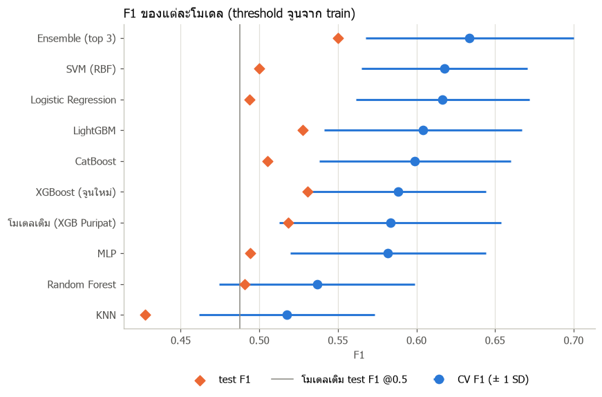
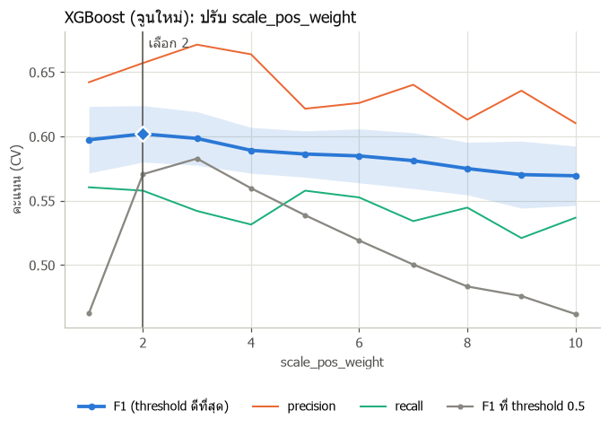
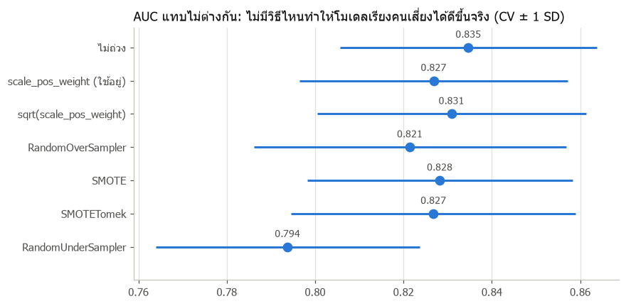
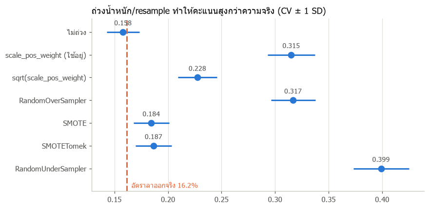

# ร่างรายงาน: Business Logic / Financial Impact / Model Localization — Saphondanai

> **สถานะ: ร่าง** เขียนจากโค้ดใน repo ณ วันที่ 30 ก.ย. 2026 (branch `dev001-Ink`)
> ตัวเลขผลโมเดลมาจาก `notebooks/04_tuning_S.ipynb` และ Model Lab (`notebooks/05`–`06`, หัวข้อ 2.1) ตัวอย่าง API และผลทั้งบริษัทคำนวณจากโมเดลสุดท้าย `attrition-xgboost-P` v1 บน MLflow กลาง (DagsHub)

## 1. ภาพรวมส่วนที่รับผิดชอบ

| ส่วน | ไฟล์ | README |
| :--- | :--- | :--- |
| MLflow กลางของทีม | `src/mlflow_setup.py`, `.env.example`, `docs/mlflow_setup.md` | 8 |
| Train + tune XGBoost (คู่ขนานกับ Puripat) | `notebooks/04_tuning_S.ipynb` | 10.3 wk2–3 |
| Model Lab: เทียบโมเดลอื่น + จูน F1 (ทดลอง) | `notebooks/05_model_comparison_S.ipynb`, `notebooks/06_param_sweep_S.ipynb`, `docs/model_lab_S/` | — |
| ทดลองวิธีแก้ข้อมูลไม่สมดุล + ตัวชี้วัดหลักพร้อม CI | `notebooks/07_imbalance_S.ipynb` | — |
| Risk Banding + Financial Impact | `src/business_rules.py`, `config/financial_impact.json` | 6.1, 6.3 |
| Company-wide Aggregate Summary | `src/company_summary.py` | 6.6 |
| API | `POST /predict`, `POST /whatif`, `GET /financial-impact/{id}`, `GET /company-summary/departments` | 7 |
| Frontend | `frontend/src/WhatIfSimulator.jsx` | 3 (Act) |

## 2. Train + Tune XGBoost (คู่ขนานกับ Puripat)

ใช้ split เดียวกับ Puripat (80/20, seed 42) แต่ค้นคนละทาง: (1) ทดลองตัดฟีเจอร์ตาม Localization (2) tune ด้วย **PR-AUC** แทน ROC AUC เพราะคนลาออกมีแค่ 16% (3) เทียบสองโมเดลบน test ชุดเดียวกัน

**ชุดฟีเจอร์ (CV 5-fold x 3 รอบบน train, hyperparameter ตั้งต้น):**

| ชุด | จำนวนฟีเจอร์ | CV AUC | CV PR-AUC |
| :--- | ---: | ---: | ---: |
| P_selected (ชุดของ Puripat) | 50 | 0.799 | 0.591 |
| localized (ตัด BusinessTravel, StockOptionLevel) | 48 | 0.788 | 0.556 |
| localized_lean (ตัดอัตราค่าจ้าง 3 คอลัมน์เพิ่ม) | 45 | 0.793 | 0.570 |

กติกาที่ตั้งก่อนดูผล: เลือกชุด localized ถ้าแพ้ไม่เกิน 0.01 PR-AUC ผลคือแพ้ 0.02–0.036 จึง **ยืนยันชุดของ Puripat** ความเสี่ยงเรื่องใช้ในไทยจัดการด้วย recalibration และคำแนะนำแบบไทยแทน

**เทียบโมเดล (หลัง tune):**

| โมเดล | CV AUC | CV PR-AUC | test AUC | test PR-AUC | test F1 | recall@top20% |
| :--- | ---: | ---: | ---: | ---: | ---: | ---: |
| P (tune ด้วย AUC) | 0.827 | 0.636 | 0.814 | 0.609 | 0.488 | 0.596 |
| S (tune ด้วย PR-AUC) | 0.824 | 0.631 | 0.807 | 0.592 | 0.496 | 0.574 |

- tune สองทางได้ hyperparameter ใกล้กันมาก (max_depth 2, min_child_weight 10, colsample ~0.53)
- ต่างกันไม่เกิน 0.017 อยู่ในระดับ noise (test มีคนลาออกแค่ 47 คน) **ทีมเลือกโมเดล P (XGBoost) เป็นโมเดลสุดท้าย** register เป็น `attrition-xgboost-P` v1
- ถ้า HR ดูแลได้ 20% ของพนักงานที่คะแนนสูงสุด โมเดลจะครอบคลุมคนที่ลาออกจริงประมาณ 60%

### 2.1 Model Lab: เทียบโมเดลอื่นและจูนเพื่อ F1 (การทดลอง ยังไม่เปลี่ยนโมเดลใน backend)

**ดูผลแบบ interactive:** เปิดไฟล์ [model_lab_S/index.html](model_lab_S/index.html) ในเบราว์เซอร์ (ดับเบิลคลิกได้เลย ไม่ต้องรัน server) ในหน้ามีกราฟเทียบโมเดล, กราฟปรับค่าทีละพารามิเตอร์ และแถบเลื่อน threshold พร้อม confusion matrix
รายละเอียดวิธีทดลองอยู่ใน `notebooks/05_model_comparison_S.ipynb` และ `notebooks/06_param_sweep_S.ipynb` ส่วน run ของแต่ละโมเดลอยู่บน DagsHub ใน experiment `attrition-model-lab-S`
ถ้ารัน notebook ใหม่ (05 เขียน `results.json`, 06 เขียน `sweeps.json`) ให้สร้างหน้าเว็บใหม่ด้วย `python docs/model_lab_S/build_page.py`

**วิธีทดลอง:**
- เทียบ 8 โมเดล (LogReg, Random Forest, SVM, KNN, MLP, XGBoost, LightGBM, CatBoost) + Ensemble บน split เดียวกับข้างบน
- จัดการข้อมูลไม่สมดุลด้วย class weight + จูน threshold จาก out-of-fold ของ train (ไม่ใช้ SMOTE)
- ทุกโมเดลจูนด้วย Optuna 30 trials เท่ากัน โดยให้ Optuna หาค่าที่ได้ F1 สูงสุด (ที่ threshold ดีที่สุด)
- test ใช้ครั้งเดียวตอนจบ

**ผล (test F1):**

| | test F1 | เพิ่มจากเดิม |
| :--- | ---: | ---: |
| โมเดลเดิม (XGB), threshold 0.5 ที่ใช้อยู่ | 0.488 | |
| โมเดลเดิม, จูน threshold เป็น 0.66 | 0.519 | +0.031 |
| Ensemble (SVM + LogReg + LightGBM), threshold 0.56 | 0.550 | +0.062 |



**สิ่งที่ได้เรียนรู้:**
- **threshold สำคัญกว่า class weight:** เมื่อจูน threshold แล้ว `scale_pos_weight` แทบไม่มีผล (F1 0.57–0.60 ทุกค่า) ต่างจากตอนตรึง threshold 0.5 ที่ F1 แกว่ง 0.46–0.58

  
- **ต้นไม้ตื้นพอ:** boosting ทุกตัวได้ผลดีสุดที่ความลึก 1–2 ชั้น และโมเดลเส้นตรง (LogReg, SVM) ทำคะแนนใกล้เคียง แสดงว่าความสัมพันธ์ในข้อมูลไม่ซับซ้อน
- **เลือกค่าด้วยกฎ 1-SE** (Hastie et al., *Elements of Statistical Learning* §7.10): ในบรรดาค่าที่ F1 ห่างจากสูงสุดไม่เกิน 1 standard error เลือกค่าที่ง่ายที่สุด เช่น RF `max_depth` 20 → 5 เพื่อลดความเสี่ยง overfit กับข้อมูล 1,176 แถว
- **CV ที่เลือก threshold บนข้อมูลชุดเดียวกับที่วัดผลสูงเกินจริงประมาณ 0.02** ตรวจด้วย nested threshold (เลือก threshold จาก fold อื่นแล้ววัดบน fold ที่เหลือ)
- ผลต่างระดับ 0.03 ระหว่างโมเดลยังอยู่ในความแกว่งปกติ (SD ระหว่าง fold ~0.07) เพราะ test มีคนลาออกแค่ 47 คน

**ข้อเสนอต่อทีม:**
1. **คง threshold 0.5 (ทีมตัดสินใจแล้ว):** ค่า 0.66 จาก OOF ได้ F1 +0.031 แต่เป็นการแลก recall กับ precision ไม่ได้ทำให้โมเดลแม่นขึ้น (AUC 0.814 เท่าเดิม คะแนนและ SHAP ไม่เปลี่ยน) และระบบไม่ได้ใช้ threshold ตัดสินลาออก/ไม่ลาออก แต่แสดงเป็น Risk Band (หัวข้อ 3) ให้ HR จัดลำดับเอง ผลบน test (294 คน ลาออกจริง 47):

   | threshold | เตือน | ถูก | เตือนผิด | หลุด | Precision | Recall | F1 |
   | ---: | ---: | ---: | ---: | ---: | ---: | ---: | ---: |
   | 0.5 (ใช้) | 76 | 30 | 46 | 17 | 0.395 | 0.638 | 0.488 |
   | 0.66 | 34 | 21 | 13 | 26 | 0.618 | 0.447 | 0.519 |
2. **ไม่เลือก Ensemble:** แม้ได้ F1 สูงสุด (+0.031 จากโมเดลเดิมที่จูน threshold แล้ว ซึ่งยังอยู่ในความแกว่งปกติ) แต่มี SVM อยู่ข้างใน ใช้ `TreeExplainer` ไม่ได้ ต้องเปลี่ยนไปใช้ KernelExplainer ซึ่งช้าและเป็นค่าประมาณ ทีมจึงเลือก XGBoost เพราะ SHAP รายบุคคลที่แม่นและเร็วเป็นหัวใจของระบบ (อธิบายเหตุผลให้ HR ได้ทุกคน)

### 2.2 การจัดการข้อมูลไม่สมดุล (Class Imbalance)

คนลาออกมี 16% ถือว่าไม่สมดุลระดับปานกลาง ทดลองเทียบ 7 วิธีใน `notebooks/07_imbalance_S.ipynb` โดยใช้โมเดลและ hyperparameter เดียวกับโมเดลสุดท้าย เปลี่ยนแค่วิธีจัดการ imbalance, resample เฉพาะ fold ที่ใช้เทรนใน CV (5 fold × 3 รอบ) เพื่อกัน data leakage, test ไม่ resample และใช้ครั้งเดียว, threshold 0.5

| วิธี (CV บน train) | AUC | PR-AUC | Precision | Recall | Brier | คะแนนเฉลี่ย (จริง 0.162) |
| :--- | ---: | ---: | ---: | ---: | ---: | ---: |
| ไม่ถ่วง | 0.835 | 0.646 | 0.804 | 0.372 | 0.091 | 0.158 |
| **scale_pos_weight (ใช้อยู่)** | 0.827 | 0.636 | 0.474 | 0.660 | 0.128 | 0.315 |
| sqrt(scale_pos_weight) | 0.831 | 0.638 | 0.641 | 0.525 | 0.100 | 0.228 |
| RandomOverSampler | 0.821 | 0.621 | 0.474 | 0.646 | 0.130 | 0.317 |
| SMOTE | 0.828 | 0.643 | 0.746 | 0.393 | 0.094 | 0.184 |
| SMOTETomek | 0.827 | 0.637 | 0.725 | 0.404 | 0.095 | 0.187 |
| RandomUnderSampler | 0.794 | 0.549 | 0.351 | 0.725 | 0.178 | 0.399 |
| scale_pos_weight + `/recalibrate` (platt) | 0.827 | 0.636 | 0.812 | 0.386 | 0.095 | 0.166 |




**ผล:**
- **AUC ทุกวิธีต่างกันน้อยกว่า SD ระหว่าง fold (~0.03)** ไม่มีวิธีไหนทำให้โมเดลแยกคนลาออกได้เก่งขึ้นจริง ยกเว้น undersampling ที่แย่ลงเพราะทิ้งข้อมูลเกือบ 70%
- สิ่งที่แต่ละวิธีเปลี่ยนคือจุดสมดุล precision ↔ recall ที่ threshold 0.5 (ผลแบบเดียวกับการขยับ threshold) และแลกมาด้วยคะแนนที่สูงเกินจริง (calibration แย่ลง)
- **SMOTE ไม่ได้ช่วย** AUC ไม่ขึ้น recall ต่ำ และสร้างพนักงานที่ไม่มีอยู่จริง (เช่น `JobLevel` 2.4) สอดคล้องกับงานวิจัย van den Goorbergh et al. (2022, *JAMIA*) และ Elor & Averbuch-Elor (2022)
- `/recalibrate` แก้ปัญหาคะแนนสูงเกินจริงได้ (คะแนนเฉลี่ย 0.315 → 0.166, Brier 0.128 → 0.095) โดยไม่เปลี่ยนโมเดลและ SHAP `platt` คงลำดับคะแนนเดิม ส่วน `isotonic` ทำให้ PR-AUC ลดเหลือ 0.596 เพราะคะแนนเป็นขั้นบันได

**ข้อสรุปของทีม:** คง `scale_pos_weight` + threshold 0.5 เพราะ recall สูงเหมาะกับงาน HR (พลาดคนจะลาออกแพงกว่าเตือนเกิน) และใช้ `/recalibrate` ปรับคะแนนเมื่อบริษัทมีข้อมูลจริง ข้อควรระวัง: หลังปรับเทียบคะแนนจะลดลงมาตรงความจริง คนที่เป็น High (≥ 0.7) จะน้อยลงมาก ต้องทบทวนเกณฑ์ Risk Band ร่วมกับทีม

### 2.3 ตัวชี้วัดหลักและขอบเขตการใช้ในไทย

**ตัวเลขที่ใช้นำเสนอ** (โมเดลสุดท้าย `attrition-xgboost-P` v1 บน test 294 คน ลาออกจริง 47 คน ช่วงความเชื่อมั่น 95% จาก bootstrap 1,000 รอบ ใน `notebooks/07_imbalance_S.ipynb` หัวข้อ 5):

| ชั้น | ตัวชี้วัด | test | 95% CI | อ่านว่า |
| :--- | :--- | ---: | :---: | :--- |
| ความแม่นของโมเดล | **ROC AUC** | 0.814 | 0.73–0.89 | สุ่มคนลาออก 1 คนกับคนไม่ลาออก 1 คน โมเดลให้คะแนนคนลาออกสูงกว่า 81% ของครั้ง |
| | **PR-AUC** | 0.609 | 0.47–0.74 | เดาสุ่มได้ 0.16 (อัตราลาออก) โมเดลดีกว่าประมาณ 3.8 เท่า |
| ประโยชน์ที่ HR ได้ | **Recall@top20%** | 0.596 | 0.45–0.71 | ดูแล 20% ที่คะแนนสูงสุด ครอบคลุมคนที่จะลาออกจริงประมาณ 60% (สุ่มได้ 20%) |
| | Recall / Precision ที่ 0.5 | 0.638 / 0.395 | 0.50–0.79 / 0.29–0.51 | เตือน 76 คน ถูก 30 คน จาก 47 คนที่ลาออกจริง |
| ความน่าเชื่อของคะแนน | Brier (ก่อน recalibrate) | 0.135 | 0.11–0.16 | คะแนนเฉลี่ย 0.32 สูงกว่าอัตราจริง 0.16 แก้ได้ด้วย `/recalibrate` (หัวข้อ 2.2) |

- **ไม่ใช้ Accuracy เป็นตัวหลัก** เพราะทายว่า "ไม่มีใครลาออก" ก็ได้ 84% แล้ว
- **ไม่ใช้ F1 เป็นตัวหลัก** เพราะขึ้นกับ threshold และระบบไม่ได้ตัดสินว่าใครลาออก แต่แสดงเป็น Risk Band ให้ HR จัดลำดับเอง
- ช่วงความเชื่อมั่นกว้าง (AUC ห่างกันได้ ±0.08) เพราะ test มีคนลาออกน้อย ผลต่างระหว่างโมเดลที่น้อยกว่านี้ (เช่น P vs S ต่างกัน 0.007) จึงสรุปไม่ได้ว่าตัวไหนดีกว่า

**ขอบเขตการใช้ในไทย:** ตัวเลขทั้งหมดวัดบนชุดข้อมูล IBM HR ซึ่งเป็นข้อมูลสมมติของบริษัทอเมริกัน จึงบอกได้ว่าวิธีการใช้ได้ แต่ **ยังไม่ใช่หลักฐานว่าโมเดลแม่นกับบริษัทไทย** สิ่งที่ปรับให้เข้ากับไทยแล้วคือส่วนของระบบ (ค่าชดเชยมาตรา 118, คำแนะนำแบบไทย, `/recalibrate`) ขั้นตอนพิสูจน์ที่เสนอ:

1. **Backtest:** ใช้ข้อมูลพนักงานย้อนหลังของบริษัทไทย 1 ปี ให้โมเดลทำนาย แล้วเทียบกับคนที่ลาออกจริง วัดด้วยตัวชี้วัดชุดเดียวกับตารางข้างบน รวมถึงคะแนนเฉลี่ยเทียบอัตราลาออกจริง
2. **เกณฑ์ผ่าน (ร่าง ต้องตกลงกับทีม):** AUC ≥ 0.70 และ Recall@top20% ≥ 0.40 (ดีกว่าสุ่มอย่างน้อย 2 เท่า) ถ้าไม่ผ่าน ต้องเทรนใหม่ด้วยข้อมูลของบริษัท
3. **Pilot:** ใช้จริง 1–2 แผนก 6 เดือน แล้วเทียบอัตราลาออกกับแผนกที่ไม่ได้ใช้

## 3. Risk Banding (README 6.1)

```
risk_score >= 0.7        -> High   (สูง)
0.4 <= risk_score < 0.7  -> Medium (ปานกลาง)
risk_score < 0.4         -> Low    (ต่ำ)
```

- ถ้าบริษัท recalibrate แล้ว ระบบแบ่งระดับจาก `calibrated_risk_score` แทน `risk_score` ดิบ
- ค่า 0.4/0.7 เป็นค่าตั้งต้นตาม README ยังไม่ได้ปรับตามการกระจายคะแนนจริง ด้วยโมเดลปัจจุบัน พนักงาน 1,470 คนแบ่งเป็น High 170 / Medium 313 / Low 987 คน

## 4. Financial Impact (README 6.3, อิงกฎหมายแรงงานไทย)

### 4.1 สูตร

```
daily_wage        = MonthlyIncome / 30
severance_pay     = daily_wage x วันค่าชดเชยตามอายุงาน (มาตรา 118)
hiring_cost       = MonthlyIncome x 12 x ตัวคูณตาม JobLevel
replacement_cost  = hiring_cost (+ severance_pay เมื่อ include_severance = true)
retain_cost       = MonthlyIncome x จำนวนเดือนตามมาตรการที่เลือก
net_benefit       = replacement_cost - retain_cost          (README: ROI)
expected_loss     = risk_score x replacement_cost
```

### 4.2 ตารางค่าชดเชย มาตรา 118 (พ.ร.บ.คุ้มครองแรงงาน ฉบับที่ 7 พ.ศ. 2562)

| อายุงาน | ค่าจ้าง |
| :--- | :--- |
| ครบ 120 วัน แต่ไม่ครบ 1 ปี | 30 วัน |
| ครบ 1 ปี แต่ไม่ครบ 3 ปี | 90 วัน |
| ครบ 3 ปี แต่ไม่ครบ 6 ปี | 180 วัน |
| ครบ 6 ปี แต่ไม่ครบ 10 ปี | 240 วัน |
| ครบ 10 ปี แต่ไม่ครบ 20 ปี | 300 วัน |
| ครบ 20 ปีขึ้นไป | 400 วัน |

### 4.3 การตัดสินใจเชิงออกแบบ

1. **ไม่รวมค่าชดเชยในต้นทุนการลาออกโดยค่าเริ่มต้น** ค่าชดเชยตามมาตรา 118 จ่ายเมื่อ *นายจ้างเลิกจ้าง* ส่วนพนักงานที่ *ลาออกเอง* ไม่มีสิทธิ์ได้รับ การบวกค่าชดเชยเข้าไปทุกกรณีจะทำให้ต้นทุนสูงเกินจริง จึงแยกเป็นตัวเลือก `include_severance` ใช้ในกรณีที่บริษัทพิจารณาเลิกจ้างแทนการรักษาไว้
2. **ตัวเลขทั้งหมดอยู่ใน `config/financial_impact.json`** แยกจากโค้ดตาม README 6.3 เมื่อกฎหมายหรือสมมติฐานของบริษัทเปลี่ยน แก้ไฟล์เดียวโดยไม่ต้อง retrain หรือแก้โค้ด
3. **ตัวคูณต้นทุนหาคนแทนไล่ตาม JobLevel (0.5–2.0 เท่าของเงินเดือนปี)** ตามเบนช์มาร์กสากลใน README เพราะตำแหน่งสูงหาคนแทนยากและใช้เวลาเรียนรู้นานกว่า
4. **อายุงาน 0 ปีนับค่าชดเชยเป็น 0 วัน** `YearsAtCompany` ใน dataset เป็นจำนวนเต็ม แยกไม่ได้ว่าครบ 120 วันหรือยัง จึงประมาณต่ำไว้ก่อน

### 4.4 ข้อจำกัด

- **หน่วยเงิน:** IBM dataset ไม่ระบุสกุลเงินของ `MonthlyIncome` ตัวเลขจึงเป็น "หน่วยตามข้อมูล" ไม่ใช่บาท เมื่อบริษัทไทยใช้ข้อมูลของตัวเอง ตัวเลขจะเป็นบาทโดยอัตโนมัติ
- **`expected_loss` สูงเกินจริงก่อน recalibrate:** โมเดลเทรนด้วย `scale_pos_weight` ทำให้คะแนนสูงกว่าความน่าจะเป็นจริง ใช้จัดลำดับความสำคัญได้ แต่ไม่ควรอ่านเป็นยอดเงินที่จะเสียจริง
- **ต้นทุนมาตรการเป็นสมมติฐาน** (เช่น ขึ้นเงินเดือน 10% = 1.2 เดือน/ปี) ยังไม่มีข้อมูลต้นทุนจริงของบริษัทไทย

## 5. Company-wide Aggregate Summary (README 6.6)

- จัดอันดับปัจจัยด้วย `mean(|SHAP|)` **โดยรวมคอลัมน์ one-hot กลับเป็นฟีเจอร์เดิม** (เช่น `JobRole_Sales Executive`, `JobRole_Manager`, … → `JobRole`) ทำได้เพราะ SHAP บวกกันได้ ถ้าไม่รวม ฟีเจอร์หมวดหมู่จะถูกแบ่งเป็นชิ้นเล็กและดูสำคัญน้อยกว่าความจริง
- ทุกปัจจัยมีธง `actionable` ปัจจัยที่บริษัทปรับได้ (OT, เงินเดือน, ความพึงพอใจ ฯลฯ) มีคำแนะนำเชิงนโยบาย ส่วนข้อมูลส่วนตัว (อายุ, สถานภาพ, เพศ) ระบุชัดว่า **ห้ามใช้เป็นเกณฑ์คัดเลือกหรือเลือกปฏิบัติ** เชื่อมกับ Fairness check (README 6.4)
- คำแนะนำใช้ถ้อยคำเชิงทิศทาง ("น่าจะช่วย") เพราะ SHAP บอกความสัมพันธ์กับโมเดล ไม่ใช่เหตุและผล
- `StockOptionLevel` แนะนำ "สวัสดิการระยะยาว เช่น สมทบกองทุนสำรองเลี้ยงชีพ" แทนสิทธิ์ซื้อหุ้น ซึ่งพบน้อยในบริษัทไทย
- `GET /company-summary/departments` สรุปทุกแผนกในครั้งเดียว เรียงตามมูลค่าความเสี่ยงรวม ให้ HR เห็นว่าควรเริ่มจากแผนกไหน

**ผลทั้งบริษัท (โมเดล `attrition-xgboost-P` v1):** ปัจจัยเด่น 5 อันดับ ได้แก่ `StockOptionLevel`, `JobRole`, `AvgSatisfaction`, `OverTimeXDistance`, `OverTime` (สัดส่วน 6–7% ต่อตัว) ถ้าไม่รวม one-hot กลับ `JobRole` จะไม่ติด 5 อันดับแรกเลย

| แผนก | คน | คะแนนเฉลี่ย | High / Medium / Low | ปัจจัยเด่น 3 อันดับ |
| :--- | ---: | ---: | :--- | :--- |
| Research & Development | 961 | 0.287 | 97 / 156 / 708 | JobRole, StockOptionLevel, AvgSatisfaction |
| Sales | 446 | 0.405 | 79 / 106 / 261 | StockOptionLevel, AvgSatisfaction, Department |
| Human Resources | 63 | 0.359 | 9 / 12 / 42 | MonthlyIncome, StockOptionLevel, NumCompaniesWorked |

Sales มีคะแนนเฉลี่ยสูงสุด แต่ R&D มีมูลค่าความเสี่ยงรวมสูงสุดเพราะคนมากกว่า 2 เท่า

## 6. Model Localization (README 6.5)

กลไกหลักคือ `POST /recalibrate` (Puripat) ส่วนที่เพิ่มในงานนี้:

1. **เลือกโมเดลโดยคำนึงถึงการใช้ในไทยตั้งแต่ตอนเทรน** ทดลองตัด `BusinessTravel` และ `StockOptionLevel` (README 4) และคอลัมน์อัตราค่าจ้างที่ไม่มีความหมาย ดูผลในหัวข้อ 2
2. **ทุก endpoint ที่คืนคะแนน** (`/predict`, `/whatif`, `/financial-impact`) รับ `tenant_id` ถ้าบริษัท recalibrate แล้วจะใช้คะแนนที่ปรับเทียบในการแบ่งระดับและคำนวณเงิน ถ้ายังไม่ได้ปรับจะแนบ `warning` ตาม README 6.5 ทุกครั้ง
3. **กฎหมายไทยอยู่ใน config** (มาตรา 118) ไม่ผูกกับโมเดล

## 7. API ส่วนของ Saphondanai

### 7.1 `POST /predict`

ระบุพนักงานได้สองแบบ (อย่างใดอย่างหนึ่ง): `employee_id` ของพนักงานที่มีในระบบ หรือ `employee` ข้อมูลทั้งก้อน (30 ฟิลด์ ตรวจชนิดและช่วงค่าด้วย Pydantic ค่าหมวดหมู่ที่โมเดลไม่รู้จักตอบ `422`)

```json
POST /predict  {"employee_id": 1}
```

```json
{"risk_score": 0.691, "calibrated_risk_score": null, "risk_band": "Medium", "risk_band_th": "ปานกลาง",
 "employee_id": 1, "warning": "ยังไม่ได้ปรับเทียบกับข้อมูลจริงของบริษัท — ..."}
```

### 7.2 `POST /whatif`

ส่ง `changes` เฉพาะฟิลด์ที่ต้องการเปลี่ยน คืนคะแนนก่อน/หลัง, `delta` (ติดลบ = เสี่ยงลดลง), ฟิลด์ที่เปลี่ยนจริง และข้อมูลหลังเปลี่ยน **ไม่บันทึกลง database**

```json
POST /whatif  {"employee_id": 1, "changes": {"OverTime": "No", "WorkLifeBalance": 4}}
```

```json
{"before": {"risk_score": 0.691, "risk_band": "Medium"},
 "after":  {"risk_score": 0.341, "risk_band": "Low"},
 "delta": -0.350, "changes_applied": {"OverTime": "No", "WorkLifeBalance": 4},
 "note": "ผลจำลองจากโมเดล ไม่ได้บันทึกลงระบบ และไม่รับประกันว่าทำจริงแล้วความเสี่ยงจะลดตามนี้"}
```

ตัวอย่าง `/financial-impact/1` (ขึ้นเงินเดือน 10%): ต้นทุนหาคนแทน 53,937, ต้นทุนมาตรการ 7,192, ส่วนต่าง 46,745 (อายุงาน 6 ปี ถ้าเป็นการเลิกจ้างจะมีค่าชดเชย 240 วัน = 47,944 แยกไว้ไม่รวม)

การตรวจข้อมูล: ฟิลด์ที่ไม่รู้จัก หรือค่าหลังเปลี่ยนผิดช่วง (เช่น `WorkLifeBalance: 9`) ตอบ `422` เพราะตรวจข้อมูลหลังรวมการเปลี่ยนแปลงด้วย schema เดียวกับ `/predict`

### 7.3 `GET /financial-impact/{employee_id}`

พารามิเตอร์: `retention` (มาตรการ ดูรายการใน `retention_options` ของ response), `include_severance`, `tenant_id`

### 7.4 `GET /company-summary/departments`

สรุปทุกแผนก (จำนวนคน, คะแนนเฉลี่ย, จำนวนตามระดับความเสี่ยง, มูลค่าความเสี่ยงรวม, ปัจจัยเด่น) เรียงตามมูลค่าความเสี่ยงรวม

## 8. What-if Simulator (React)

- โหลดพนักงานด้วยรหัส แล้วปรับเฉพาะ **ปัจจัยที่ HR ทำได้จริง** 14 ตัว (เงินเดือน, OT, การเดินทาง, ความพึงพอใจ, การอบรม ฯลฯ) ไม่เปิดให้ปรับข้อมูลส่วนตัว เช่น อายุ เพศ สถานภาพ
- คำนวณใหม่อัตโนมัติหลังหยุดปรับ 300ms (debounce) และยกเลิก request เก่าที่ยังไม่ตอบ (`AbortController`) ผลจึงไม่สลับลำดับเมื่อลากแถบเลื่อนเร็ว ๆ
- แสดงระดับความเสี่ยงก่อน/หลัง, คะแนนที่เปลี่ยน, ฟิลด์ที่ปรับแล้วไฮไลต์ และตาราง Retain vs Replace เลือกมาตรการได้

## 9. การทดสอบ

- `python -m pytest backend` ครอบคลุม: `/predict` ทั้งสองแบบให้ผลตรงกัน, input ผิด 5 แบบ, `/whatif` ไม่เปลี่ยนอะไรต้องเท่ากับ `/predict`, เลิก OT แล้วความเสี่ยงลด, ใช้ผล recalibrate ในการคำนวณ `delta`, สูตรเงินและตารางมาตรา 118 ทุกช่วงอายุงาน, การรวม one-hot ใน company summary
